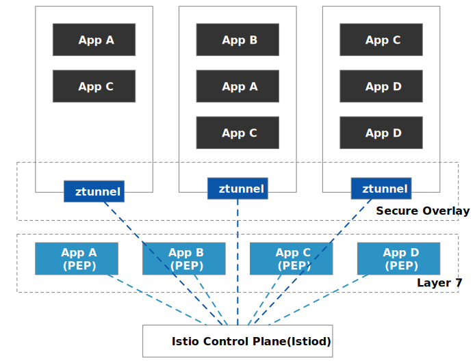
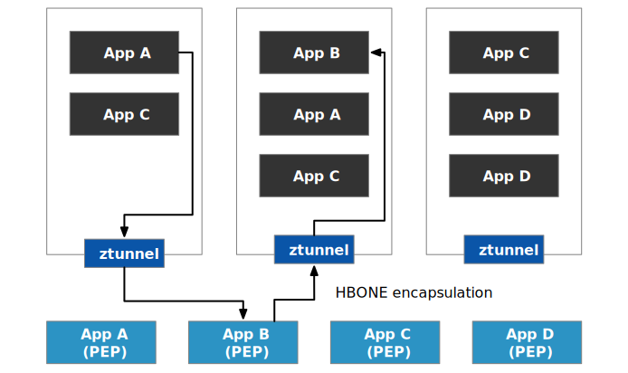

我们最近发布了 Istio Ambient Mesh（译者注：笔者更倾向于将其称为 Ambient Mode，即外围模式，但译文中仍然保留了 Ambient Mesh 的叫法），它是 Istio 的无 sidecar 数据平面。如[公告博客中所述](/blog/introducing-ambient-mesh/)，我们使用 Ambient Mesh 解决的首要问题是简化操作、更广泛的应用程序兼容性、降低基础设施成本和提高性能。在设计 ambient 数据平面时，我们希望在不牺牲安全性或功能的情况下仔细平衡运维、成本和性能方面的问题。随着 ambient 组件在应用程序 pod 之外运行，安全边界发生了变化 —— 我们相信会变得更好。在这篇博客中，我们将详细介绍这些安全性变化以及它们与 sidecar 部署模式在安全性方面的对比。

回顾一下，Istio Ambient Mesh 引入了一个分层网格数据平面，它具有负责传输安全和路由的安全覆盖层，可以选择为需要它们的命名空间添加 L7 功能。要了解更多信息，请参阅[公告博客](https://istio.io/latest/blog/2022/introducing-ambient-mesh/)和[入门博客](https://istio.io/latest/blog/2022/get-started-ambient)。安全覆盖层包括一个节点共享组件 ztunnel，它负责 L4 遥测和部署为 DaemonSet 的 mTLS。网格的 L7 层由 Waypoint 代理提供，完整的 L7 Envoy 代理按身份/工作负载类型部署。这种设计的一些基本原则包括：

- 应用程序与数据平面分离
- 安全覆盖层的组件类似于 CNI
- 操作简单更利于安全
- 避免多租户 L7 代理
- Sidecar 仍然是首选的部署模式之一

## 应用程序和数据平面分离

尽管 Ambient Mesh 的主要目标是简化服务网格的操作，但它也确实有助于提高安全性。复杂性会滋生漏洞，企业应用程序（及其传递依赖项、库和框架）极其复杂且容易出现漏洞。从处理复杂的业务逻辑到利用 OSS 库或有缺陷的内部共享库，攻击者（来自内部或外部）的主要目标是用户的应用程序代码。如果应用程序遭到破坏，凭据、机密和密钥就会暴露给攻击者，包括那些安装或存储在内存中的数据。在查看 sidecar 模型时，sidecar 接管应用程序中的身份/密钥材料。 在 Istio ambient 模式下，数据平面组件不会与应用程序运行在同一个 pod 中，因此，应用程序的中的秘密不会泄露给数据平面。

作为漏洞的潜在目标，Envoy Proxy 怎么样？Envoy 是一个经过严格审查的极其坚固的基础设施，并[在关键环境中大规模运行](https://www.infoq.com/news/2018/12/envoycon-service-mesh/)（例如，[用于生产以支持 Google 的网络](https://cloud.google.com/load-balancing/docs/https)）。然而，由于 Envoy 是软件，它不能免受漏洞的影响。当漏洞出现时，Envoy 有一个强大的 CVE 流程来识别快速修复它们，并在它们产生广泛影响之前将补丁推送给客户。

回到前面 “复杂性滋生漏洞” 的评论，Envoy Proxy 最复杂的部分在于其 L7 处理，事实上，历史上 Envoy 的大多数漏洞都在其 L7 处理堆栈中。但是，如果你只将 Istio 用于 mTLS 会怎样？当你不使用该功能时，为什么要冒险部署一个更容易发生 CVE 的成熟 L7 代理？分离 L4 和 L7 网格功能在这里很有用。在 Sidecar 部署中，你采用所有代理，即使你只使用一小部分功能，在 ambient 模式下，我们可以通过提供安全覆盖并仅根据需要在 L7 中分层来限制暴露。此外，L7 组件完全独立于应用程序运行，不会暴露供攻击面。

## 将 L4 下推到 CNI

Ambient 数据平面的 L4 组件作为 DaemonSet 运行，或者说每个节点一个。这意味着它是在特定节点上运行的所有 Pod 的共享基础架构。这个组件特别敏感，应该与节点上的任何其他共享组件（例如任何 CNI 代理、kube-proxy、kubelet 甚至 Linux 内核）处于同一级别。来自工作负载的流量被重定向到 ztunnel，ztunnel 然后识别工作负载并选择正确的证书来代表 mTLS 连接中的工作负载。

ztunnel 为每个 pod 使用一个独特的凭证，只有当 pod 在当前节点上运行时才会被发出。这确保了被破坏的 ztunnel 的爆炸半径——只有调度到当前节点上的 pod 的凭证可以被盗。这是一个类似于其他实现良好的共享节点基础设施的属性，包括其他安全 CNI 实现。ztunnel 不使用集群范围或每个节点的凭证，如果被盗，可能会立即危及集群中的所有应用流量，除非这些应用也实施复杂的二级授权机制。

如果我们将其与 sidecar 模式进行比较，我们会注意到 ztunnel 是共享的，它的暴露可能导致节点上运行的应用程序的身份泄露。但是，该组件中出现 CVE 的可能性低于 Istio sidecar，因为攻击面大大减少（仅 L4 处理）；ztunnel 不做任何 L7 处理。此外，sidecar 中的 CVE（具有更大的 L7 攻击面）并没有真正包含在受到损害的特定工作负载中。Sidecar 中的所有严重的 CVE 都可能在网格中的任何工作负载复现。

## 操作简单更利于安全

归根结底，Istio 是一个关键的基础设施，必须进行维护。Istio 代表应用程序实施零信任网络安全的一些原则受到信任，按计划或按需求推出补丁是最重要的。平台团队通常有可预测的补丁或维护周期，这与应用程序的周期完全不同。当需要新的能力和功能时，应用程序可能会被更新，通常是项目的一部分。这种对应用程序变化、升级、框架和库补丁的方法，是非常不可预测的，会耗费大量时间，不适合安全实践。因此，保持这些安全功能是平台的一部分，与应用程序分开，有利于保持更好的安全态势。

正如我们在公告博客中指出的，由于 sidecar 的侵入性，操作 sidecar 可能会更加复杂（注入 sidecar/改变部署描述，重启应用程序，容器之间的竞争条件等）。对带有 sidecar 的工作负载的升级需要更多的计划和滚动重启，可能需要协调，以避免应用程序崩溃。有了 Ambient Mesh，对 ztunnel 的升级可以与任何正常的节点补丁或升级同时进行，而 waypoint 代理是网络的一部分，可以根据需要对应用程序进行完全透明的升级。

## 避免多租户 L7 代理

支持 L7 协议（例如 HTTP 1/2/3、gRPC、解析标头、实现重试、在数据平面中使用 Wasm 或 Lua 进行自定义）比支持 L4 复杂得多。实现这些行为的代码要多得多（包括 Lua 和 Wasm 等用户自定义代码），这种复杂性可能会导致潜在的漏洞。正因为如此，CVE 在这些 L7 功能领域中出现的几率更高。

在 ambient mesh 中，我们不在多个身份之间共享代理中的 L7 处理。每个身份（Kubernetes 中的服务账户）都有自己专门的 L7 代理（waypoint 代理），这与我们使用的 sidecar 模型非常相似。试图将多个身份、复杂的不同的策略和定制放在一起，会给共享资源增加很多变数，最好的情况是导致资源的不公平分配，最坏的情况是导致代理被完全破坏。

## Sidecar 模式仍然是首先的部署模式之一

我们理解，有些人对 sidecar 模型及其已知的安全边界感到满意，并希望留在该模型上。Sidecar 仍然是网格的一等公民，平台所有者可以选择继续使用它们。如果平台所有者想同时支持 sidecar 和 ambient 也是可以。具有 ambient 数据平面的工作负载可以与部署了 sidecar 的工作负载进行本地通信。随着人们更好地了解 ambient mesh 的安全态势，我们相信，ambient 将成为 Istio 服务网格的首选模式，而 sidecar 则用于特定的优化。

