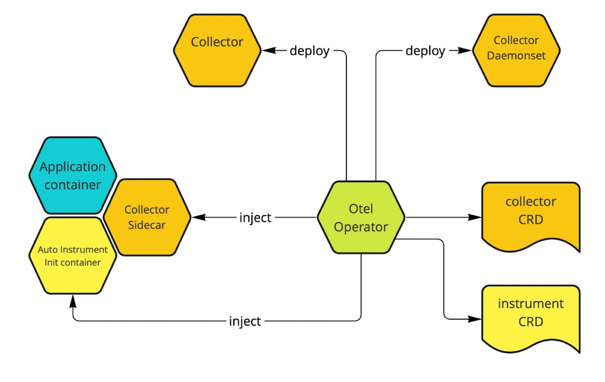

## 前言

OpenTelemetry 追踪包含了理解分布式系统和排除故障的信息宝库 —— 但你的服务必须首先被指标化，以发射 OpenTelemetry 追踪来实现这一价值。然后，这些追踪信息需要被发送到一个可观察的后端，使你能够获得关于这些数据的任意问题的答案。可观测性是一个分析问题。

本周早些时候，我们部分解决了这个问题，宣布[在 Promscale 中普遍提供 OpenTelemetry 追踪支持](https://www.timescale.com/blog/observability-powered-by-sql-understand-your-systems-like-never-before-with-opentelemetry-traces-and-postgresql/)，将由 SQL 驱动的可观测性带给所有开发者。随着对分析语言 ——SQL 的全面支持，我们解决了分析的问题。但我们仍然需要解决第一部分的问题：测量。

为了让你的服务发出追踪数据，你必须手动添加 OpenTelemetry 测量工具到代码中。而且你必须针对所有服务和你使用的所有框架来做，否则你将无法看到每个请求的执行情况。你还需要部署 OpenTelemetry 收集器来接收所有新的追踪，处理它们，批处理它们，并最终将它们发送到你的可观测性后端。这需要花费大量的时间和精力。

如果你不需要做所有这些手工工作，并且可以在几分钟内而不是几小时甚至几天内启动和运行呢？如果你还能建立一个完整的可观测性技术栈并自动连接所有的组件呢？如果我告诉你，你可以用一个命令完成所有这些工作呢？

我不是疯子。我只是一个 [Tobs](https://docs.timescale.com/promscale/latest/tobs/) 用户😎。

Tobs 是 Kubernetes 的可观测性技术栈，是一个可以用来[在几分钟内在 Kubernetes 集群中部署一个完整的可观测性技术栈](https://www.timescale.com/blog/introducing-tobs-deploy-a-full-observability-suite-for-kubernetes-in-two-minutes/)的工具。该栈包括 OpenTelemetry Operator、OpenTelemetry Collector、Promscale 和 Grafana。它还部署了其他几个工具，如 Prometheus，以收集 Kubernetes 集群的指标，并将其发送到 Promscale。[在我们的最新版本中](https://github.com/timescale/tobs/releases/tag/0.10.1)，tobs 包括支持通过 OpenTelemetry Operator 用 OpenTelemetry 追踪自动检测你的 Python、Java 和 Node.js 服务。

是的，你没看错：自动！你不需要改变服务中的任何一行代码，就可以让它们被检测出来。锦上添花的是什么？你可以通过执行 helm 命令来部署一切。

有了 tobs，你可以安装你的可观测性技术栈，只需几步就能搞定你的 OpenTelemetry 指标化的第一层。告别繁琐的配置工作，因为你的框架会自己检测。

如果你想了解如何做到这一点，请继续阅读本博文。首先，我们将解释一切是如何运作的，剖析 OpenTelemetry Operator 在内部的真正作用。接下来，我们将通过一个例子演示如何将其直接付诸实践。

- 我们将通过 tobs 在我们的 Kubernetes 集群中安装一个完整的可观测性技术栈。
- 我们将部署一个云原生 Python 应用程序。
- 我们将检查我们的应用程序是如何被 OpenTelemetry 追踪器自动检测到的，这要归功于 tobs 和 OpenTelemetry Operator 所做的魔术🪄。

## OpenTelemetry Operator

[OpenTelemetry](https://opentelemetry.io/) 是一个开源的框架，可以捕获、转换和路由所有类型的信号（追踪、日志和指标）。在大多数情况下，你会使用 [OpenTelemetry SDK](https://open-telemetry.github.io/opentelemetry-js/) 来在你的应用程序代码中生成这些信号。但是，在某些情况下，OpenTelemetry 可以自动检测你的代码 —— 也就是说，当你的应用框架被支持，并且你使用的语言是 OpenTelemetry 可以注入代码的。在这种情况下，你的系统将开始产生遥测，而不需要手动工作。

要了解 OpenTelemetry 是如何做到这一点的，我们首先需要熟悉 [OpenTelemetry Operator](https://github.com/open-telemetry/opentelemetry-operator)。OpenTelemetry Operator 是一个实现 [Kubernetes Operator 模式](https://kubernetes.io/docs/concepts/extend-kubernetes/operator/)的应用程序，与 Kubernetes 集群中的两个 CustomResourceDefinitions（CRD）互动。



[基于 CustomResourceDefinitions（CRD](https://kubernetes.io/docs/concepts/extend-kubernetes/api-extension/custom-resources/)）实例的变化，Operator 为我们管理以下两点：

1. 创建和删除 OpenTelemetry Collector 实例
2. 将 OpenTelemetry 自动测量所需的库和二进制文件直接注入到你的 pod 中

让我们更详细地解读这两项任务。

## 管理 OpenTelemetry Collector

OpenTelemetry Operator 的首要任务是部署 [OpenTelemetry Collector](https://opentelemetry.io/docs/collector/) 实例。这些实例将被用来把信号从源头（你的工作负载和 Kubernetes 本身）路由到它们的目标（支持 OpenTelemetry 协议的存储系统或集群外的另一个采集器）。

采集器可以以三种不同的方式部署：

1. 作为 Kubernetes Deployment：这是默认选项，它允许采集器根据需要在节点之间移动，支持向上和向下扩展。
2. 作为 Kubernetes Daemonset：这个选项将在每个节点上部署一个采集器，当你想确保你的信号在没有任何网络开销的情况下被处理时，它可能很有用。
3. 作为一个 Sidecar：被注入到任何新的注释的 pod 中（使用 `sidecar.opentelemetry.io/inject: true`）。当采集器需要一个 pod 的特定配置时，这可能是很好的（例如，也许它需要一些专门的转换）。

如果你愿意，你可以混合和匹配这些收集器模式。例如，你可以设置一个 sidecar，为部署中的 pod 做一些转换，然后将它们发送到一个全局收集器，与你的其他工作负载共享。

定义这些收集器实例的配置在收集器 CRD（`opentelemetrycollectors.opentelemetry.io`）中进行建模。允许多个实例来实现更复杂的模式。部署类型是通过 `mode` 设置来选择的，伴随着一个原始的配置字符串，它被逐字传递给控制器，并作为配置加载。下面是使用 Deployment 模式创建 Operator 的 CRD 的例子。

```yaml
apiVersion: opentelemetry.io/v1alpha1
kind: OpenTelemetryCollector
metadata:
  name: tobs-tobs-opentelemetry
  namespace: default
Spec:
  mode: deployment
  config: |
    receivers:
      jaeger:
        protocols:
          grpc:
          thrift_http:

      otlp:
        protocols:
          grpc:
          http:

    exporters:
      logging:
      otlp:
        endpoint: "tobs-promscale-connector.default.svc:9202"
        compression: none
        tls:
          insecure: true
      prometheusremotewrite:
        endpoint: "tobs-promscale-connector.default.svc:9201/write"
        tls:
          insecure: true

    processors:
      batch:

    service:
      pipelines:
        traces:
          receivers: [jaeger, otlp]
          exporters: [logging, otlp]
          processors: [batch]
        metrics:
          receivers: [otlp]
          processors: [batch]
          exporters: [prometheusremotewrite]    
```

正如我们在后面的例子中看到的，当你使用 [tobs](https://docs.timescale.com/promscale/latest/tobs/) 时，你不需要担心所有这些配置细节。tobs 的好处之一是它会为你安装一个采集器，它将直接把数据发送到本地的 Promscale 实例。

## 在 Kubernetes 中添加 OpenTelemetry 自动监测系统

Operator 的第二个关注点是将 OpenTelemetry 自动测量所需的库和二进制文件注入到 pod 中。要做到这一点，这些 pod 需要容纳 Java、Python 或 Node.js 应用程序（OpenTelemetry 将来会支持更多语言）。

用于部署这些 pod 的 Kubernetes 清单文件必须包括一个注释，以指示 OpenTelemetry Operator 对其进行检测。

```
instrumentation.opentelemetry.io/inject-<language>: "true"   
```

其中 `language` 可以是 `python`、`java` 或 `nodejs`。

当注解的 pod 启动时，会创建一个 `init` 容器，注入所需的代码并改变 pod 运行代码的方式，使用正确的 OpenTelemetry 自动探测方法。实际上，这意味着在使用 Kubernetes 时，不需要修改任何代码就可以获得自动监测的好处。该配置还定义了 OpenTelemetry Collector 端点，这些追踪将被发送到该端点，传播的信息类型，以及我们用来采样追踪的方法（如果有的话）(关于 [CRD 的全部细节，请看文档](https://github.com/open-telemetry/opentelemetry-operator/blob/main/docs/api.md)）。

为 Python、Java 和 Node.js 应用程序提供自动测量的自定义资源的例子是这样的。

```yaml
apiVersion: opentelemetry.io/v1alpha1
kind: Instrumentation
metadata:
  name: tobs-auto-instrumentation
  namespace: default
spec:
  exporter:
    endpoint: http://tobs-opentelemetry-collector.default.svc:4318 
  propagators:
    - tracecontext
    - baggage
    - b3
  sampler:
    argument: "0.25"
    type: parentbased_traceidratio
```

再一次，如果你使用 [tobs](https://docs.timescale.com/promscale/latest/tobs/)，你将不需要自己创建这些自定义资源。Tobs 将确保集群被自动配置成对任何有注释的 pod 进行检测，而不需要你做任何操作。你所需要做的就是在你想收集追踪的 pod 中添加以下注释之一。

```
instrumentation.opentelemetry.io/inject-java: "true"
instrumentation.opentelemetry.io/inject-nodejs: "true"
instrumentation.opentelemetry.io/inject-python:"true"
```

让我们通过一个例子看看这在实践中是如何运作的。

## 使用 OpenTelemetry Operator 和 Tobs

在本节中，我们将使用我们的[微服务演示应用程序](https://github.com/timescale/opentelemetry-demo)，它由一个过度工程化的密码生成器应用程序组成。[在 repo 中](https://github.com/timescale/opentelemetry-demo)，你可以找到一个已测量的版本和一个未测量的版本，这就是我们在这个例子中要使用的版本。

要运行这个，你首先需要一个 Kubernetes 集群，安装了 cert-manager，配置了通过 `kubectl`（至少需要 1.21.0 版本）的访问，并安装了 [helm](https://helm.sh/)。为了部署和运行所有不同的组件，你将需要在你的 Kubernetes 集群中提供大约 4 核 CPU 和 8GB 的内存。

如果你的集群中没有 cert-manager，你将需要使用这个命令来安装它。

```bash
kubectl apply -f 
https://github.com/cert-manager/cert-manager/releases/download/v1.8.0/cert-manager.yaml
```

准备好后，让我们使用 Timescale Helm Chart 来安装 tobs。在命令提示符下运行以下命令。

```bash
helm repo add timescale https://charts.timescale.com/ --force-update
helm install --wait --timeout 10m tobs timescale/tobs
```

Tobs 需要几分钟的时间来安装，但最终，你会看到类似这样的输出。

```bash
#helm install --wait tobs timescale/tobs
NAME: tobs
LAST DEPLOYED: Thu May 19 11:22:19 2022
NAMESPACE: default
STATUS: deployed
REVISION: 1
NOTES:
###############################################################################
👋🏽 Welcome to tobs, The Observability Stack for Kubernetes

✨ Auto-configured and deployed:
🔥 Kube-Prometheus
🐯 TimescaleDB
🤝 Promscale
🧐 PromLens
📈 Grafana
🚀 OpenTelemetry
🎯 Jaeger

###################################
```

👉 故障排除提示：如果你得到这个错误信息 `INSTALLATION FAILED: rate:Wait(n=1) would exceed context deadline`，这很可能表明你的集群中没有足够的可用资源。

一旦 tobs 的安装完成，检查你的 Kubernetes 集群，确认所有的组件都已正确部署。

```bash
kubectl get podes --all-namespaces | grep "tobs-"
```

👉故障排除提示：如果某些 pod 处于待定或错误状态，你可以使用 `kubectl describe pod <pod-name>` 或 `kubectl logs <pod-name>` 来了解可能存在的问题。

现在，我们可以从 [OpenTelemetry Demo GitHub repo](https://github.com/timescale/opentelemetry-demo) 中导入未测量的 Kubernetes 微服务。

如果你回顾一下 `uninstrumented` 文件夹中的代码，你会发现它没有提到 OpenTelemetry。例如，看一下 `load` 微服务的 Python 文件（这个服务通过发出密码请求来驱动其他服务的流量）。

```python
if __name__ == '__main__':
    main()
```

通过将这些微服务导入安装了 tobs 的集群中，它们将自动获得 OpenTelemetry 追踪的测量工具。

要调出演示应用程序，请运行：

```bash
kubectl apply -k 'http://github.com/timescale/opentelemetry-demo/yaml/app' 
```

当这个过程结束，应用程序被部署时，它将已经被 OpenTelemetry 追踪器所记录。追踪现在正在生成并自动发送到 Promscale。

这种魔法是如何发生的？

这里有一个总结性的解释：

- 每个 pod 都被注解为 `instrumentation.opentelemetry.io/inject-python: "true"`，所以当它们启动时，会被 OpenTelemetry Operator 注意到。
- 接下来，使用一个突变的 webhook 添加一个 init 容器，注入 Python 库和启用测量工具所需的代码。
- 然后，追踪数据被发送到 Instrumentation CRD 中注明的 OpenTelemetry Collector。
- OpenTelemetry Collector 将数据发送到 Promscale（和 TimescaleDB），从那里可以直接用 SQL 查询或用 Grafana 等工具进行可视化访问。

让我们看看我们直接从 Grafana（tobs 也自动安装在我们的集群中）自动生成的追踪。

要获得 Grafana 实例的管理用户的密码，请运行以下命令。

```bash
kubectl get secret tobs-grafana -o jsonpath="{.data.admin-password}"| base64 -d 
kubectl port-forward svc/tobs-grafana 3000:80
```

然后，导航到 http://localhost:3000/d/vBhEewLnk，使用你刚刚找回的密码，以管理员用户身份登录。

[Promscale 应用性能监控（APM）仪表盘](https://docs.timescale.com/promscale/latest/visualize-data/apm-experience/)将显示出来，向你展示关于演示应用的洞察力。Tobs 直接导入这套开箱即用、可用于生产的仪表盘，我们在 Grafana 中使用 SQL 查询对追踪数据进行构建，在这种情况下，它是由演示微服务自动生成的。下图显示了其中一个仪表盘 ——“服务详情”。

](service-overview.png "用演示应用程序的追踪数据填充的[服务细节仪表盘](https://docs.timescale.com/promscale/latest/visualize-data/apm-experience/)")

关于这些预建仪表盘的更多信息，请[查看这篇博文](https://www.timescale.com/blog/observability-powered-by-sql-understand-your-systems-like-never-before-with-opentelemetry-traces-and-postgresql/)（导航到 “集成到 Grafana 的现代 APM 体验” 一节）。

我们已经得到了所有这些信息，而在任何 Python 服务中都没有测量工具代码。

## 总结

OpenTelemetry 追踪从未像现在这样方便。[如果你的微服务是用 OpenTelemetry Operator 目前支持的语言之一编写的](https://opentelemetry.io/docs/collector/)，你可以立即开始收集和存储追踪数据，只需要很少的手动工作。你只需采取以下两个步骤：

- [通过 Helm 在你的 Kubernetes 集群中安装 tobs](https://github.com/timescale/tobs/blob/master/chart/README.md#install)(请注意，你必须使用 Helm 来安装 tobs，才能使这个最新版本发挥作用，而不是使用 CLI)。
- 在部署之前，给你想收集追踪数据的微服务 pods 添加[注解](https://github.com/open-telemetry/opentelemetry-operator#opentelemetry-auto-instrumentation-injection)（例如 `instrumentation.opentelemetry.io/inject-python: "true"`）。

你的微服务将自动被 OpenTelemetry 追踪器检测，你的追踪器将自动存储在 Promscale 中，Promscale 是建立在 PostgreSQL 和 TimescaleDB 上的统一的指标和追踪器的可观测性后端。

通过 [Promscale 预先建立的 APM 仪表盘](https://docs.timescale.com/promscale/latest/visualize-data/apm-experience/)，你将立即了解到你的系统性能如何，并且你将能够[使用 SQL 查询你的追踪](https://www.timescale.com/blog/observability-powered-by-sql-understand-your-systems-like-never-before-with-opentelemetry-traces-and-postgresql/)。
