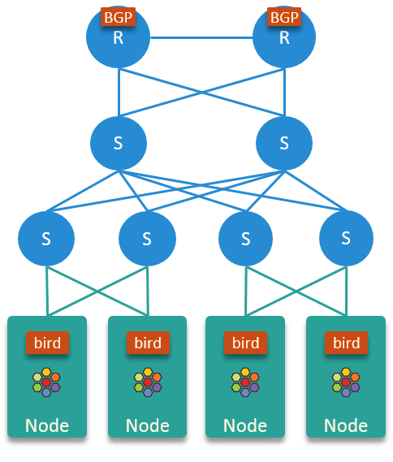
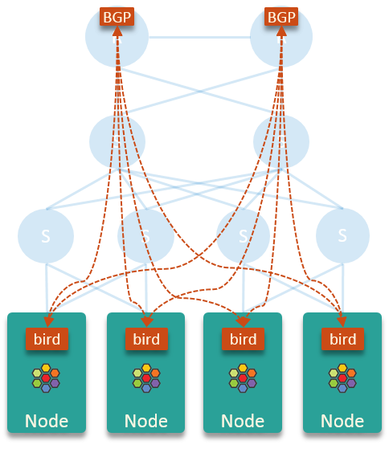

::: {.only}
not (epub or latex or html)

WARNING: You are looking at unreleased Cilium documentation. Please use
the official rendered version released here: <https://docs.cilium.io>
:::

Using BIRD to run BGP
=====================

[BIRD is an open-source implementation for routing Internet Protocol
packets on Unix-like operating
systems](https://en.wikipedia.org/wiki/Bird_Internet_routing_daemon). If
you are not familiar with it, you had best have a glance at the [User\'s
Guide](https://bird.network.cz/?get_doc&f=bird.html&v=20) first.

BIRD provides a way to advertise routes using traditional networking
protocols to allow Cilium-managed endpoints to be accessible outside the
cluster. This guide assumes that Cilium is already deployed in the
cluster, and that the remaining piece is how to ensure that the pod CIDR
ranges are externally routable.

[BIRD](https://bird.network.cz) maintains two release families at
present: `1.x` and `2.x`, and the configuration format varies a lot
between them. Unless you have already deployed the `1.x`, we suggest
using `2.x` directly, as the `2.x` will live longer. The following
examples will denote `bird` as the `bird2` software and use
configuration in the format that `bird2` understands.

This guide shows how to install and configure bird on CentOS 7.x to make
it collaborate with Cilium. Installation and configuration on other
platforms should be very similar.

Install bird
------------

``` {.shell-session}
$ yum install -y bird2

$ systemctl enable bird
$ systemctl restart bird
```

Test the installation:

``` {.shell-session}
$ birdc show route
BIRD 2.0.6 ready.

$ birdc              # interactive shell
BIRD 2.0.6 ready.
bird> show bfd sessions
There is no BFD protocol running
bird>
bird> show protocols all
Name       Proto      Table      State  Since         Info
device1    Device     ---        up     10:53:40.147

direct1    Direct     ---        down   10:53:40.147
  Channel ipv4
    State:          DOWN
    Input filter:   ACCEPT
    Output filter:  REJECT
...
```

Basic configuration
-------------------

It\'s hard to discuss bird configurations without considering specific
BGP schemes. However, BGP scheme design is beyond the scope of this
guide. If you are interested in this topic, refer to [BGP in the Data
Center](https://www.oreilly.com/library/view/bgp-in-the/9781491983416/)
(O\'Reilly, 2017) for a quick start.

In the following, we will restrict our BGP scenario as follows:



-   physical network: simple 3-tier hierarchical architecture
-   nodes connect to physical network via layer 2 switches
-   announcing each node\'s PodCIDR to physical network via `bird`
-   for each node, do not import route announcements from physical
    network

In this design, the BGP connections look like this:



This scheme is simple in that:

-   core routers learn PodCIDRs from `bird`, which makes the Pod IP
    addresses routable within the entire network.
-   `bird` doesn\'t learn routes from core routers and other nodes,
    which keeps the kernel routing table of each node clean and small,
    and suffering no performance issues.

In this scheme, each node just sends pod egress traffic to node\'s
default gateway (the core routers), and lets the latter do the routing.

Below is the a reference configuration for fulfilling the above
purposes:

    $ cat /etc/bird.conf
    log syslog all;

    router id {{ NODE_IP }};

    protocol device {
            scan time 10;           # Scan interfaces every 10 seconds
    }

    # Disable automatically generating direct routes to all network interfaces.
    protocol direct {
            disabled;               # Disable by default
    }

    # Forbid synchronizing BIRD routing tables with the OS kernel.
    protocol kernel {
            ipv4 {                    # Connect protocol to IPv4 table by channel
                    import none;      # Import to table, default is import all
                    export none;      # Export to protocol. default is export none
            };
    }

    # Static IPv4 routes.
    protocol static {
          ipv4;
          route {{ POD_CIDR }} via "cilium_host";
    }

    # BGP peers
    protocol bgp uplink0 {
          description "BGP uplink 0";
          local {{ NODE_IP }} as {{ NODE_ASN }};
          neighbor {{ NEIGHBOR_0_IP }} as {{ NEIGHBOR_0_ASN }};
          password {{ NEIGHBOR_PWD }};

          ipv4 {
                  import filter {reject;};
                  export filter {accept;};
          };
    }

    protocol bgp uplink1 {
          description "BGP uplink 1";
          local {{ NODE_IP }} as {{ NODE_ASN }};
          neighbor {{ NEIGHBOR_1_IP }} as {{ NEIGHBOR_1_ASN }};
          password {{ NEIGHBOR_PWD }};

          ipv4 {
                  import filter {reject;};
                  export filter {accept;};
          };
    }

Save the above file as `/etc/bird.conf`, and replace the placeholders
with your own:

``` {.shell-session}
sed -i 's/{{ NODE_IP }}/<your node ip>/g'                /etc/bird.conf
sed -i 's/{{ POD_CIDR }}/<your pod cidr>/g'              /etc/bird.conf
sed -i 's/{{ NODE_ASN }}/<your node asn>/g'              /etc/bird.conf
sed -i 's/{{ NEIGHBOR_0_IP }}/<your neighbor 0 ip>/g'    /etc/bird.conf
sed -i 's/{{ NEIGHBOR_1_IP }}/<your neighbor 1 ip>/g'    /etc/bird.conf
sed -i 's/{{ NEIGHBOR_0_ASN }}/<your neighbor 0 asn>/g'  /etc/bird.conf
sed -i 's/{{ NEIGHBOR_1_ASN }}/<your neighbor 1 asn>/g'  /etc/bird.conf
sed -i 's/{{ NEIGHBOR_PWD }}/<your neighbor password>/g' /etc/bird.conf
```

Restart `bird` and check the logs:

``` {.shell-session}
$ systemctl restart bird

# check logs
$ journalctl -u bird
-- Logs begin at Sat 2020-02-22 16:11:44 CST, end at Mon 2020-02-24 18:58:35 CST. --
Feb 24 18:58:24 node systemd[1]: Started BIRD Internet Routing Daemon.
Feb 24 18:58:24 node systemd[1]: Starting BIRD Internet Routing Daemon...
Feb 24 18:58:24 node bird[137410]: Started
```

Verify the changes, you should get something like this:

``` {.shell-session}
$ birdc show route
BIRD 2.0.6 ready.
Table master4:
10.5.48.0/24         unicast [static1 20:14:51.478] * (200)
        dev cilium_host
```

This indicates that the PodCIDR `10.5.48.0/24` on this node has been
successfully imported into BIRD.

``` {.shell-session}
$ birdc show protocols all uplink0 | grep -A 3 -e "Description" -e "stats"
  Description:    BGP uplink 0
  BGP state:          Established
    Neighbor address: 10.4.1.7
    Neighbor AS:      65418
--
    Route change stats:     received   rejected   filtered    ignored   accepted
      Import updates:              0          0          0          0          0
      Import withdraws:           10          0        ---         10          0
      Export updates:              1          0          0        ---          1
```

Here we see that the uplink0 BGP session is established and our PodCIDR
from above has been exported and accepted by the BGP peer.

Monitoring
----------

[bird_exporter](https://github.com/czerwonk/bird_exporter) could collect
bird daemon states, and export Prometheus-style metrics.

It also provides a simple Grafana dashboard, but you could also create
your own, e.g.
[Trip.com\'s](https://ctripcloud.github.io/cilium/network/2020/01/19/trip-first-step-towards-cloud-native-networking.html)
looks like this:


Advanced Configurations
-----------------------

You may need some advanced configurations to make your BGP scheme
production-ready. This section lists some of these parameters, but we
will not dive into details, that\'s BIRD [User\'s
Guide](https://bird.network.cz/?get_doc&f=bird.html&v=20)\'s
responsibility.

### BFD

[Bidirectional Forwarding Detection
(BFD)](https://www.cisco.com/c/en/us/td/docs/ios-xml/ios/iproute_bgp/configuration/xe-16/irg-xe-16-book/bgp-support-for-bfd.html)
is a detection protocol designed to accelerate path failure detection.

**This feature also relies on peer side\'s configuration.**

    protocol bfd {
          interface "{{ grains['node_mgnt_device'] }}" {
                  min rx interval 100 ms;
                  min tx interval 100 ms;
                  idle tx interval 300 ms;
                  multiplier 10;
                  password {{ NEIGHBOR_PWD }};
          };

          neighbor {{ NEIGHBOR_0_IP] }};
          neighbor {{ NEIGHBOR_1_IP] }};
    }

    protocol bgp uplink0 {
            ...

            bfd on;
    }

Verify, you should see something like this:

``` {.shell-session}
$ birdc show bfd sessions
BIRD 2.0.6 ready.
bfd1:
IP address                Interface  State      Since         Interval  Timeout
10.5.40.2                 bond0      Up         20:14:51.479    0.300    0.000
10.5.40.3                 bond0      Up         20:14:51.479    0.300    0.000
```

### ECMP

For some special purposes (e.g. L4LB), you may configure a same CIDR on
multiple nodes. In this case, you need to configure [Equal-Cost
Multi-Path (ECMP)
routing](https://en.wikipedia.org/wiki/Equal-cost_multi-path_routing).

**This feature also relies on peer side\'s configuration.**

    protocol kernel {
            ipv4 {                    # Connect protocol to IPv4 table by channel
                    import none;      # Import to table, default is import all
                    export none;      # Export to protocol. default is export none
            };

            # Configure ECMP
            merge paths yes limit {{ N }} ;
    }

See the user manual for more detailed information.

You need to check the ECMP correctness on physical network (Core router
in the above scenario):

``` {.shell-session}
CORE01# show ip route 10.5.2.0
IP Route Table for VRF "default"
'*' denotes best ucast next-hop
'**' denotes best mcast next-hop
'[x/y]' denotes [preference/metric]
'%<string>' in via output denotes VRF <string>

10.5.2.0/24, ubest/mbest: 2/0
    *via 10.4.1.7, [200/0], 13w6d, bgp-65418, internal, tag 65418
    *via 10.4.1.8, [200/0], 12w4d, bgp-65418, internal, tag 65418
```

### Graceful restart

**This feature also relies on peer side\'s configuration.**

Add `graceful restart` to each `bgp` section:

    protocol bgp uplink0 {
            ...

            graceful restart;
    }
