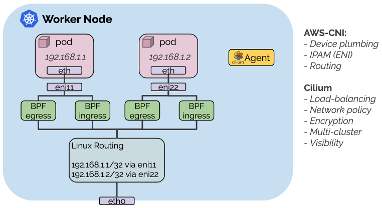

::: {.only}
not (epub or latex or html)

WARNING: You are looking at unreleased Cilium documentation. Please use
the official rendered version released here: <https://docs.cilium.io>
:::

AWS VPC CNI plugin {#chaining_aws_cni}
==================

This guide explains how to set up Cilium in combination with the AWS VPC
CNI plugin. In this hybrid mode, the AWS VPC CNI plugin is responsible
for setting up the virtual network devices as well as for IP address
management (IPAM) via ENIs. After the initial networking is setup for a
given pod, the Cilium CNI plugin is called to attach eBPF programs to
the network devices set up by the AWS VPC CNI plugin in order to enforce
network policies, perform load-balancing and provide encryption.

::: {.important}
::: {.title}
Important
:::

Please ensure that you are running version
[1.7.9](https://github.com/aws/amazon-vpc-cni-k8s/releases/tag/v1.7.9)
or newer of the AWS VPC CNI plugin to guarantee compatibility with
Cilium.

``` {.shell-session}
$ kubectl -n kube-system get ds/aws-node -o json | jq -r '.spec.template.spec.containers[0].image'
602401143452.dkr.ecr.us-west-2.amazonaws.com/amazon-k8s-cni:v1.7.5-eksbuild.1
```

If you are running an older version, as in the above example, you can
upgrade it with:

``` {.shell-session}
$ kubectl apply -f https://raw.githubusercontent.com/aws/amazon-vpc-cni-k8s/v1.7.9/config/v1.7/aws-k8s-cni.yaml
```
:::



Setting up a cluster on AWS
---------------------------

Follow the instructions in the `k8s_install_quick`{.interpreted-text
role="ref"} guide to set up an EKS cluster, or use any other method of
your preference to set up a Kubernetes cluster on AWS.

Ensure that the
[aws-vpc-cni-k8s](https://github.com/aws/amazon-vpc-cni-k8s) plugin is
installed --- which will already be the case if you have created an EKS
cluster. Also, ensure the version of the plugin is up-to-date as per the
above.

Deploy Cilium via Helm:

::: {.parsed-literal}

helm install cilium \\

:   \--namespace kube-system \\ \--set cni.chainingMode=aws-cni \\
    \--set enableIPv4Masquerade=false \\ \--set tunnel=disabled
:::

This will enable chaining with the AWS VPC CNI plugin. It will also
disable tunneling, as it\'s not required since ENI IP addresses can be
directly routed in the VPC. For the same reason, masquerading can be
disabled as well.

Restart existing pods
---------------------

The new CNI chaining configuration *will not* apply to any pod that is
already running in the cluster. Existing pods will be reachable, and
Cilium will load-balance *to* them, but not *from* them. Policy
enforcement will also not be applied. For these reasons, you must
restart these pods so that the chaining configuration can be applied to
them.

The following command can be used to check which pods need to be
restarted:

``` {.bash}
for ns in $(kubectl get ns -o jsonpath='{.items[*].metadata.name}'); do
     ceps=$(kubectl -n "${ns}" get cep \
         -o jsonpath='{.items[*].metadata.name}')
     pods=$(kubectl -n "${ns}" get pod \
         -o custom-columns=NAME:.metadata.name,NETWORK:.spec.hostNetwork \
         | grep -E '\s(<none>|false)' | awk '{print $1}' | tr '\n' ' ')
     ncep=$(echo "${pods} ${ceps}" | tr ' ' '\n' | sort | uniq -u | paste -s -d ' ' -)
     for pod in $(echo $ncep); do
       echo "${ns}/${pod}";
     done
done
```

Advanced
--------

### Enabling security groups for pods (EKS)

Cilium can be used alongside the [security groups for
pods](https://docs.aws.amazon.com/eks/latest/userguide/security-groups-for-pods.html)
feature of EKS in supported clusters when running in chaining mode.
Follow the instructions below to enable this feature:

::: {.important}
::: {.title}
Important
:::

The following guide requires [jq](https://stedolan.github.io/jq/) and
the [AWS CLI](https://aws.amazon.com/cli/) to be installed and
configured.
:::

Make sure that the `AmazonEKSVPCResourceController` managed policy is
attached to the IAM role associated with the EKS cluster:

``` {.shell-session}
export EKS_CLUSTER_NAME="my-eks-cluster" # Change accordingly
export EKS_CLUSTER_ROLE_NAME=$(aws eks describe-cluster \
     --name "${EKS_CLUSTER_NAME}" \
     | jq -r '.cluster.roleArn' | awk -F/ '{print $NF}')
aws iam attach-role-policy \
     --policy-arn arn:aws:iam::aws:policy/AmazonEKSVPCResourceController \
     --role-name "${EKS_CLUSTER_ROLE_NAME}"
```

Then, and as mentioned above, make sure that the version of the AWS VPC
CNI plugin running in the cluster is up-to-date:

``` {.shell-session}
kubectl -n kube-system get ds/aws-node \
  -o jsonpath='{.spec.template.spec.containers[0].image}'
602401143452.dkr.ecr.us-west-2.amazonaws.com/amazon-k8s-cni:v1.7.10
```

Next, patch the `kube-system/aws-node` DaemonSet in order to enable
security groups for pods:

``` {.shell-session}
kubectl -n kube-system patch ds aws-node \
  -p '{"spec":{"template":{"spec":{"initContainers":[{"env":[{"name":"DISABLE_TCP_EARLY_DEMUX","value":"true"}],"name":"aws-vpc-cni-init"}],"containers":[{"env":[{"name":"ENABLE_POD_ENI","value":"true"}],"name":"aws-node"}]}}}}'
kubectl -n kube-system rollout status ds aws-node
```

After the rollout is complete, all nodes in the cluster should have the
`vps.amazonaws.com/has-trunk-attached` label set to `true`:

``` {.shell-session}
kubectl get nodes -L vpc.amazonaws.com/has-trunk-attached
NAME                                            STATUS   ROLES    AGE   VERSION              HAS-TRUNK-ATTACHED
ip-192-168-111-169.eu-west-2.compute.internal   Ready    <none>   22m   v1.19.6-eks-49a6c0   true
ip-192-168-129-175.eu-west-2.compute.internal   Ready    <none>   22m   v1.19.6-eks-49a6c0   true
```

From this moment everything should be in place. For details on how to
actually associate security groups to pods, please refer to the
[official
documentation](https://docs.aws.amazon.com/eks/latest/userguide/security-groups-for-pods.html).
