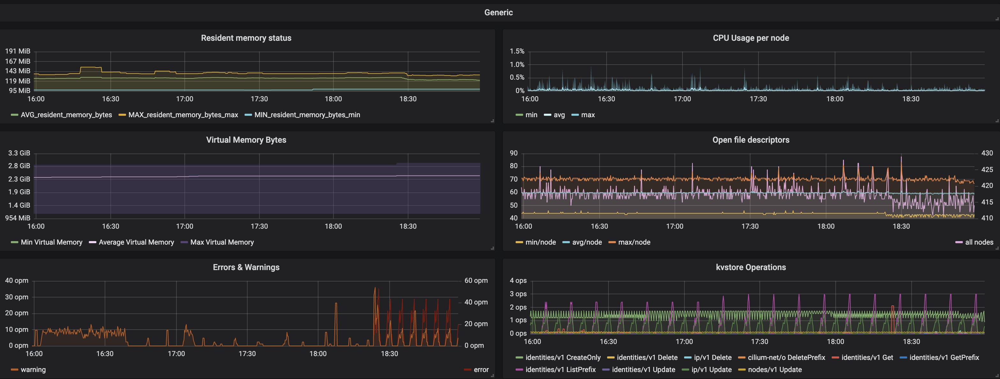
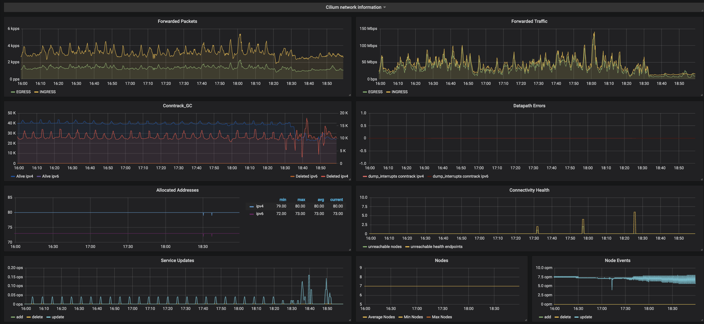
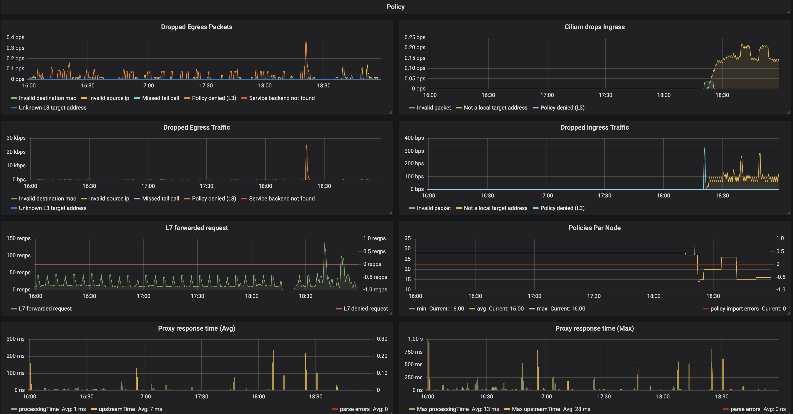
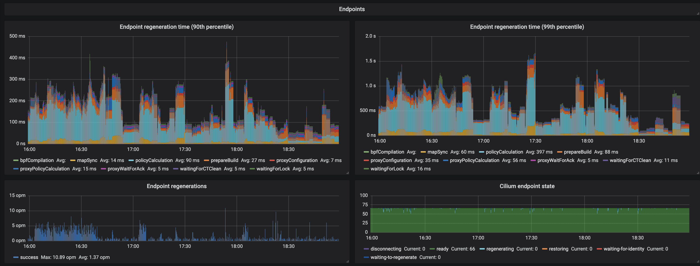
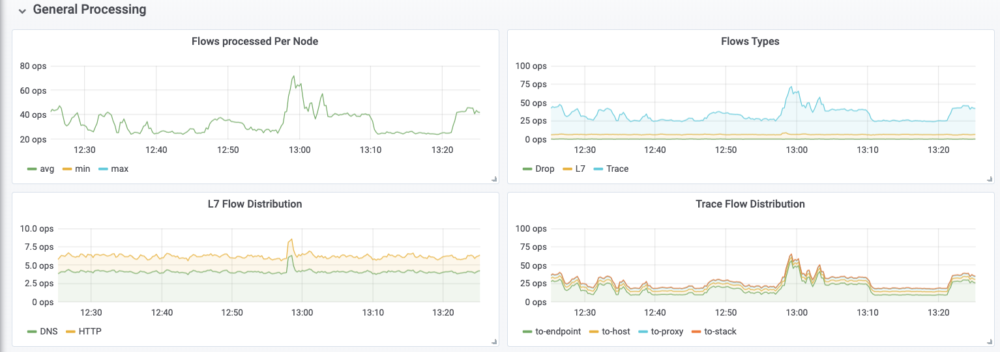
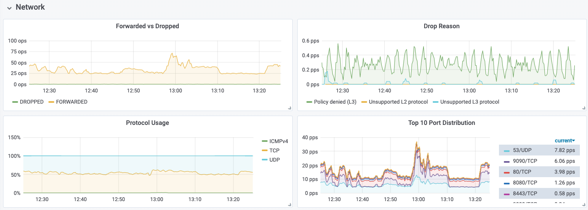
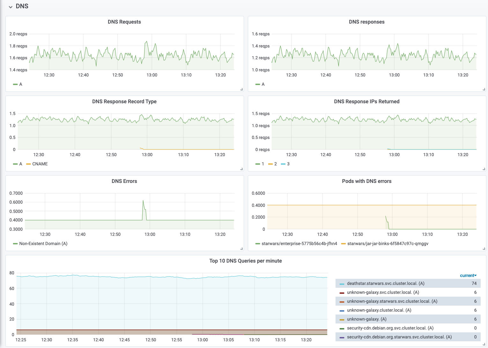
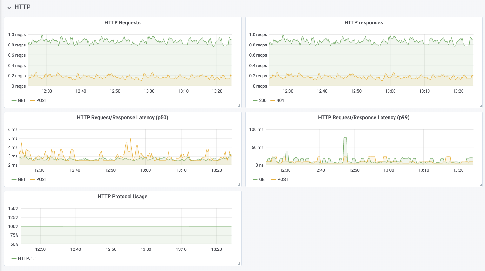

::: {.only}
not (epub or latex or html)

WARNING: You are looking at unreleased Cilium documentation. Please use
the official rendered version released here: <https://docs.cilium.io>
:::

Running Prometheus & Grafana {#install_metrics}
============================

Install Prometheus & Grafana
----------------------------

This is an example deployment that includes Prometheus and Grafana in a
single deployment.

The default installation contains:

-   **Grafana**: A visualization dashboard with Cilium Dashboard
    pre-loaded.
-   **Prometheus**: a time series database and monitoring system.

> ::: {.parsed-literal}
> \$ kubectl apply -f
> /examples/kubernetes/addons/prometheus/monitoring-example.yaml
> namespace/cilium-monitoring created serviceaccount/prometheus-k8s
> created configmap/grafana-config created
> configmap/grafana-cilium-dashboard created
> configmap/grafana-cilium-operator-dashboard created
> configmap/grafana-hubble-dashboard created configmap/prometheus
> created clusterrole.rbac.authorization.k8s.io/prometheus unchanged
> clusterrolebinding.rbac.authorization.k8s.io/prometheus unchanged
> service/grafana created service/prometheus created
> deployment.apps/grafana created deployment.apps/prometheus created
> :::

This example deployment of Prometheus and Grafana will automatically
scrape the Cilium and Hubble metrics. See the
`metrics`{.interpreted-text role="ref"} configuration guide on how to
configure a custom Prometheus instance.

Deploy Cilium and Hubble with metrics enabled
---------------------------------------------

*Cilium*, *Hubble*, and *Cilium Operator* do not expose metrics by
default. Enabling metrics for these services will open ports `9090`,
`9091`, and `6942` respectively on all nodes of your cluster where these
components are running.

The metrics for Cilium, Hubble, and Cilium Operator can all be enabled
independently of each other with the following Helm values:

> -   `prometheus.enabled=true`: Enables metrics for `cilium-agent`.
> -   `operator.prometheus.enabled=true`: Enables metrics for
>     `cilium-operator`.
> -   `hubble.metrics.enabled`: Enables the provided list of Hubble
>     metrics. For Hubble metrics to work, Hubble itself needs to be
>     enabled with `hubble.enabled=true`. See
>     `Hubble exported metrics<hubble_exported_metrics>`{.interpreted-text
>     role="ref"} for the list of available Hubble metrics.

Refer to `metrics`{.interpreted-text role="ref"} for more details about
the individual metrics.

Deploy Cilium via Helm as follows to enable all metrics:

::: {.parsed-literal}

helm install cilium \\

:   \--namespace kube-system \\ \--set prometheus.enabled=true \\ \--set
    operator.prometheus.enabled=true \\ \--set hubble.enabled=true \\
    \--set
    hubble.metrics.enabled=\"{dns,drop,tcp,flow,port-distribution,icmp,http}\"
:::

::: {.note}
::: {.title}
Note
:::

You can combine the above Helm options with any of the other
installation guides.
:::

How to access Grafana
---------------------

Expose the port on your local machine

``` {.shell-session}
kubectl -n cilium-monitoring port-forward service/grafana --address 0.0.0.0 --address :: 3000:3000
```

Access it via your browser: <http://localhost:3000>

How to access Prometheus
------------------------

Expose the port on your local machine

``` {.shell-session}
kubectl -n cilium-monitoring port-forward service/prometheus --address 0.0.0.0 --address :: 9090:9090
```

Access it via your browser: <http://localhost:9090>

Examples
--------

### Generic



### Network



### Policy




### Endpoints



### Controllers


### Kubernetes


### Hubble General Processing



### Hubble Networking

::: {.note}
::: {.title}
Note
:::

The `port-distribution` metric is disabled by default. Refer to
`metrics`{.interpreted-text role="ref"} for more details about the
individual metrics.
:::




### Hubble DNS



### Hubble HTTP



### Hubble Network Policy


