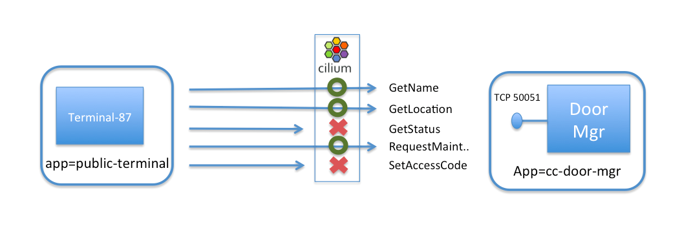

::: {.only}
not (epub or latex or html)

WARNING: You are looking at unreleased Cilium documentation. Please use
the official rendered version released here: <https://docs.cilium.io>
:::

How to secure gRPC
==================

This document serves as an introduction to using Cilium to enforce
gRPC-aware security policies. It is a detailed walk-through of getting a
single-node Cilium environment running on your machine. It is designed
to take 15-30 minutes.

It is important for this demo that `kube-dns` is working correctly. To
know the status of `kube-dns` you can run the following command:

``` {.shell-session}
$ kubectl get deployment kube-dns -n kube-system
NAME       DESIRED   CURRENT   UP-TO-DATE   AVAILABLE   AGE
kube-dns   1         1         1            1           13h
```

Where at least one pod should be available.

Deploy the Demo Application
---------------------------

Now that we have Cilium deployed and `kube-dns` operating correctly we
can deploy our demo gRPC application. Since our first demo of Cilium +
HTTP-aware security policies was Star Wars-themed, we decided to do the
same for gRPC. While the [HTTP-aware Cilium Star Wars
demo](https://cilium.io/blog/2017/5/4/demo-may-the-force-be-with-you/)
showed how the Galactic Empire used HTTP-aware security policies to
protect the Death Star from the Rebel Alliance, this gRPC demo shows how
the lack of gRPC-aware security policies allowed Leia, Chewbacca, Lando,
C-3PO, and R2-D2 to escape from Cloud City, which had been overtaken by
empire forces.

[gRPC](https://grpc.io/) is a high-performance RPC framework built on
top of the [protobuf](https://developers.google.com/protocol-buffers/)
serialization/deserialization library popularized by Google. There are
gRPC bindings for many programming languages, and the efficiency of the
protobuf parsing as well as advantages from leveraging HTTP 2 as a
transport make it a popular RPC framework for those building new
microservices from scratch.

For those unfamiliar with the details of the movie, Leia and the other
rebels are fleeing storm troopers and trying to reach the space port
platform where the Millennium Falcon is parked, so they can fly out of
Cloud City. However, the door to the platform is closed, and the access
code has been changed. However, R2-D2 is able to access the Cloud City
computer system via a public terminal, and disable this security,
opening the door and letting the Rebels reach the Millennium Falcon just
in time to escape.


In our example, Cloud City\'s internal computer system is built as a set
of gRPC-based microservices (who knew that gRPC was actually invented a
long time ago, in a galaxy far, far away?).

With gRPC, each service is defined using a language independent protocol
buffer definition. Here is the definition for the system used to manage
doors within Cloud City:

``` {.java}
package cloudcity;

// The door manager service definition.
service DoorManager {

  // Get human readable name of door.
  rpc GetName(DoorRequest) returns (DoorNameReply) {}

  // Find the location of this door.
  rpc GetLocation (DoorRequest) returns (DoorLocationReply) {}

  // Find out whether door is open or closed
  rpc GetStatus(DoorRequest) returns (DoorStatusReply) {}

  // Request maintenance on the door
  rpc RequestMaintenance(DoorMaintRequest) returns (DoorActionReply) {}

  // Set Access Code to Open / Lock the door
  rpc SetAccessCode(DoorAccessCodeRequest) returns (DoorActionReply) {}

}
```

To keep the setup small, we will just launch two pods to represent this
setup:

-   **cc-door-mgr**: A single pod running the gRPC door manager service
    with label `app=cc-door-mgr`.
-   **terminal-87**: One of the public network access terminals
    scattered across Cloud City. R2-D2 plugs into terminal-87 as the
    rebels are desperately trying to escape. This terminal uses the gRPC
    client code to communicate with the door management services with
    label `app=public-terminal`.


The file `cc-door-app.yaml` contains a Kubernetes Deployment for the
door manager service, a Kubernetes Pod representing `terminal-87`, and a
Kubernetes Service for the door manager services. To deploy this example
app, run:

::: {.parsed-literal}
\$ kubectl create -f /examples/kubernetes-grpc/cc-door-app.yaml
deployment \"cc-door-mgr\" created service \"cc-door-server\" created
pod \"terminal-87\" created
:::

Kubernetes will deploy the pods and service in the background. Running
`kubectl get svc,pods` will inform you about the progress of the
operation. Each pod will go through several states until it reaches
`Running` at which point the setup is ready.

``` {.shell-session}
$ kubectl get pods,svc
NAME                                 READY     STATUS    RESTARTS   AGE
po/cc-door-mgr-3590146619-cv4jn      1/1       Running   0          1m
po/terminal-87                       1/1       Running   0          1m

NAME                 CLUSTER-IP   EXTERNAL-IP   PORT(S)     AGE
svc/cc-door-server   10.0.0.72    <none>        50051/TCP   1m
svc/kubernetes       10.0.0.1     <none>        443/TCP     6m
```

Test Access Between gRPC Client and Server
------------------------------------------

First, let\'s confirm that the public terminal can properly act as a
client to the door service. We can test this by running a Python gRPC
client for the door service that exists in the *terminal-87* container.

We\'ll invoke the \'cc_door_client\' with the name of the gRPC method to
call, and any parameters (in this case, the door-id):

``` {.shell-session}
$ kubectl exec terminal-87 -- python3 /cloudcity/cc_door_client.py GetName 1
Door name is: Spaceport Door #1

$ kubectl exec terminal-87 -- python3 /cloudcity/cc_door_client.py GetLocation 1
Door location is lat = 10.222200393676758 long = 68.87879943847656
```

Exposing this information to public terminals seems quite useful, as it
helps travelers new to Cloud City identify and locate different doors.
But recall that the door service also exposes several other methods,
including `SetAccessCode`. If access to the door manager service is
protected only using traditional IP and port-based firewalling, the TCP
port of the service (50051 in this example) will be wide open to allow
legitimate calls like `GetName` and `GetLocation`, which also leave more
sensitive calls like `SetAccessCode` exposed as well. It is this
mismatch between the course granularity of traditional firewalls and the
fine-grained nature of gRPC calls that R2-D2 exploited to override the
security and help the rebels escape.

To see this, run:

``` {.shell-session}
$ kubectl exec terminal-87 -- python3 /cloudcity/cc_door_client.py SetAccessCode 1 999
Successfully set AccessCode to 999
```

Securing Access to a gRPC Service with Cilium
---------------------------------------------

Once the legitimate owners of Cloud City recover the city from the
empire, how can they use Cilium to plug this key security hole and block
requests to `SetAccessCode` and `GetStatus` while still allowing
`GetName`, `GetLocation`, and `RequestMaintenance`?



Since gRPC build on top of HTTP, this can be achieved easily by
understanding how a gRPC call is mapped to an HTTP URL, and then
applying a Cilium HTTP-aware filter to allow public terminals to only
invoke a subset of all the total gRPC methods available on the door
service.

Each gRPC method is mapped to an HTTP POST call to a URL of the form
`/cloudcity.DoorManager/<method-name>`.

As a result, the following *CiliumNetworkPolicy* rule limits access of
pods with label `app=public-terminal` to only invoke `GetName`,
`GetLocation`, and `RequestMaintenance` on the door service, identified
by label `app=cc-door-mgr`:

::: {.literalinclude language="yaml" emphasize-lines="9,13,21"}
../../examples/kubernetes-grpc/cc-door-ingress-security.yaml
:::

A *CiliumNetworkPolicy* contains a list of rules that define allowed
requests, meaning that requests that do not match any rules (e.g.,
`SetAccessCode`) are denied as invalid.

The above rule applies to inbound (i.e., \"ingress\") connections to
`cc-door-mgr pods` (as indicated by `app: cc-door-mgr` in the
\"endpointSelector\" section). The rule will apply to connections from
pods with label `app: public-terminal` as indicated by the
\"fromEndpoints\" section. The rule explicitly matches gRPC connections
destined to TCP 50051, and white-lists specifically the permitted URLs.

Apply this gRPC-aware network security policy using `kubectl` in the
main window:

::: {.parsed-literal}
\$ kubectl create -f
/examples/kubernetes-grpc/cc-door-ingress-security.yaml
:::

After this security policy is in place, access to the innocuous calls
like `GetLocation` still works as intended:

``` {.shell-session}
$ kubectl exec terminal-87 -- python3 /cloudcity/cc_door_client.py GetLocation 1
Door location is lat = 10.222200393676758 long = 68.87879943847656
```

However, if we then again try to invoke `SetAccessCode`, it is denied:

``` {.shell-session}
$ kubectl exec terminal-87 -- python3 /cloudcity/cc_door_client.py SetAccessCode 1 999

Traceback (most recent call last):
  File "/cloudcity/cc_door_client.py", line 71, in <module>
    run()
  File "/cloudcity/cc_door_client.py", line 53, in run
    door_id=int(arg2), access_code=int(arg3)))
  File "/usr/local/lib/python3.4/dist-packages/grpc/_channel.py", line 492, in __call__
    return _end_unary_response_blocking(state, call, False, deadline)
  File "/usr/local/lib/python3.4/dist-packages/grpc/_channel.py", line 440, in _end_unary_response_blocking
    raise _Rendezvous(state, None, None, deadline)
grpc._channel._Rendezvous: <_Rendezvous of RPC that terminated with (StatusCode.CANCELLED, Received http2 header with status: 403)>
```

This is now blocked, thanks to the Cilium network policy. And notice
that unlike a traditional firewall which would just drop packets in a
way indistinguishable from a network failure, because Cilium operates at
the API-layer, it can explicitly reply with an custom HTTP 403
Unauthorized error, indicating that the request was intentionally denied
for security reasons.

Thank goodness that the empire IT staff hadn\'t had time to deploy
Cilium on Cloud City\'s internal network prior to the escape attempt, or
things might have turned out quite differently for Leia and the other
Rebels!

Clean-Up
--------

You have now installed Cilium, deployed a demo app, and tested L7
gRPC-aware network security policies. To clean-up, run:

::: {.parsed-literal}
\$ kubectl delete -f /examples/kubernetes-grpc/cc-door-app.yaml \$
kubectl delete cnp rule1
:::

After this, you can re-run the tutorial from Step 1.
