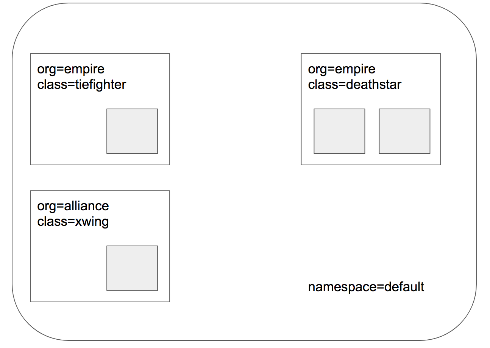

Deploy the Demo Application
===========================

Now that we have Cilium deployed and `kube-dns` operating correctly we
can deploy our demo application.

In our Star Wars-inspired example, there are three microservices
applications: *deathstar*, *tiefighter*, and *xwing*. The *deathstar*
runs an HTTP webservice on port 80, which is exposed as a [Kubernetes
Service](https://kubernetes.io/docs/concepts/services-networking/service/)
to load-balance requests to *deathstar* across two pod replicas. The
*deathstar* service provides landing services to the empire\'s
spaceships so that they can request a landing port. The *tiefighter* pod
represents a landing-request client service on a typical empire ship and
*xwing* represents a similar service on an alliance ship. They exist so
that we can test different security policies for access control to
*deathstar* landing services.

**Application Topology for Cilium and Kubernetes**



The file `http-sw-app.yaml` contains a [Kubernetes
Deployment](https://kubernetes.io/docs/concepts/workloads/controllers/deployment/)
for each of the three services. Each deployment is identified using the
Kubernetes labels (`org=empire, class=deathstar`),
(`org=empire, class=tiefighter`), and (`org=alliance, class=xwing`). It
also includes a deathstar-service, which load-balances traffic to all
pods with label (`org=empire, class=deathstar`).

::: {.parsed-literal}
\$ kubectl create -f /examples/minikube/http-sw-app.yaml
service/deathstar created deployment.extensions/deathstar created
pod/tiefighter created pod/xwing created
:::

Kubernetes will deploy the pods and service in the background. Running
`kubectl get pods,svc` will inform you about the progress of the
operation. Each pod will go through several states until it reaches
`Running` at which point the pod is ready.

``` {.shell-session}
$ kubectl get pods,svc
NAME                             READY   STATUS    RESTARTS   AGE
pod/deathstar-6fb5694d48-5hmds   1/1     Running   0          107s
pod/deathstar-6fb5694d48-fhf65   1/1     Running   0          107s
pod/tiefighter                   1/1     Running   0          107s
pod/xwing                        1/1     Running   0          107s

NAME                 TYPE        CLUSTER-IP    EXTERNAL-IP   PORT(S)   AGE
service/deathstar    ClusterIP   10.96.110.8   <none>        80/TCP    107s
service/kubernetes   ClusterIP   10.96.0.1     <none>        443/TCP   3m53s
```

Each pod will be represented in Cilium as an
`endpoint`{.interpreted-text role="ref"}. We can invoke the `cilium`
tool inside the Cilium pod to list them:

``` {.shell-session}
$ kubectl -n kube-system get pods -l k8s-app=cilium
NAME           READY   STATUS    RESTARTS   AGE
cilium-5ngzd   1/1     Running   0          3m19s

$ kubectl -n kube-system exec cilium-1c2cz -- cilium endpoint list
ENDPOINT   POLICY (ingress)   POLICY (egress)   IDENTITY   LABELS (source:key[=value])                       IPv6   IPv4         STATUS
           ENFORCEMENT        ENFORCEMENT
232        Disabled           Disabled          16530      k8s:class=deathstar                                      10.0.0.147   ready
                                                           k8s:io.cilium.k8s.policy.cluster=default
                                                           k8s:io.cilium.k8s.policy.serviceaccount=default
                                                           k8s:io.kubernetes.pod.namespace=default
                                                           k8s:org=empire
726        Disabled           Disabled          1          reserved:host                                                         ready
883        Disabled           Disabled          4          reserved:health                                          10.0.0.244   ready
1634       Disabled           Disabled          51373      k8s:io.cilium.k8s.policy.cluster=default                 10.0.0.118   ready
                                                           k8s:io.cilium.k8s.policy.serviceaccount=coredns
                                                           k8s:io.kubernetes.pod.namespace=kube-system
                                                           k8s:k8s-app=kube-dns
1673       Disabled           Disabled          31028      k8s:class=tiefighter                                     10.0.0.112   ready
                                                           k8s:io.cilium.k8s.policy.cluster=default
                                                           k8s:io.cilium.k8s.policy.serviceaccount=default
                                                           k8s:io.kubernetes.pod.namespace=default
                                                           k8s:org=empire
2811       Disabled           Disabled          51373      k8s:io.cilium.k8s.policy.cluster=default                 10.0.0.47    ready
                                                           k8s:io.cilium.k8s.policy.serviceaccount=coredns
                                                           k8s:io.kubernetes.pod.namespace=kube-system
                                                           k8s:k8s-app=kube-dns
2843       Disabled           Disabled          16530      k8s:class=deathstar                                      10.0.0.89    ready
                                                           k8s:io.cilium.k8s.policy.cluster=default
                                                           k8s:io.cilium.k8s.policy.serviceaccount=default
                                                           k8s:io.kubernetes.pod.namespace=default
                                                           k8s:org=empire
3184       Disabled           Disabled          22654      k8s:class=xwing                                          10.0.0.30    ready
                                                           k8s:io.cilium.k8s.policy.cluster=default
                                                           k8s:io.cilium.k8s.policy.serviceaccount=default
                                                           k8s:io.kubernetes.pod.namespace=default
                                                           k8s:org=alliance
```

Both ingress and egress policy enforcement is still disabled on all of
these pods because no network policy has been imported yet which select
any of the pods.
