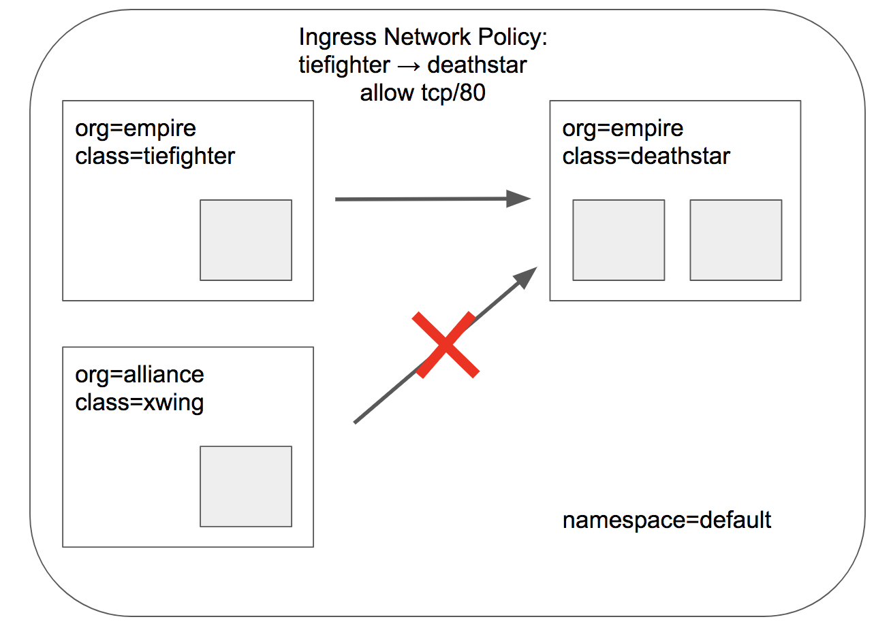
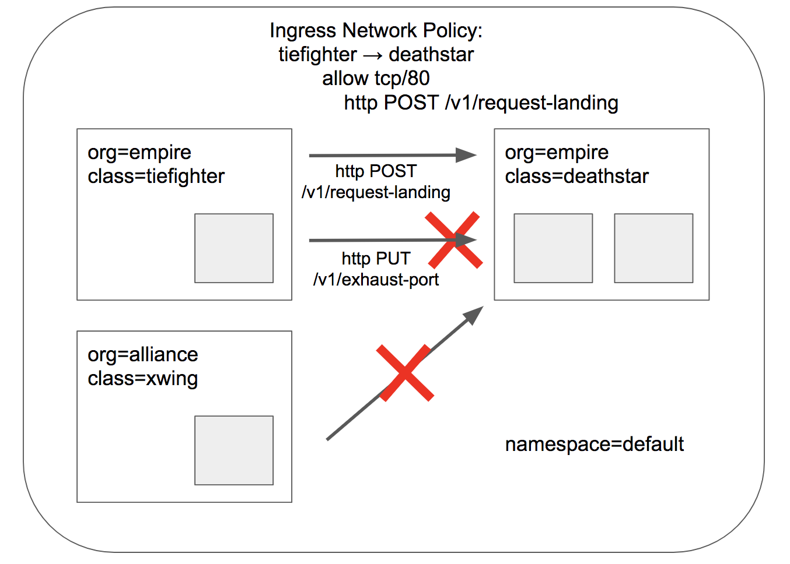

::: {.only}
not (epub or latex or html)

WARNING: You are looking at unreleased Cilium documentation. Please use
the official rendered version released here: <https://docs.cilium.io>
:::

Identity-Aware and HTTP-Aware Policy Enforcement {#gs_http}
================================================

Check Current Access
--------------------

From the perspective of the *deathstar* service, only the ships with
label `org=empire` are allowed to connect and request landing. Since we
have no rules enforced, both *xwing* and *tiefighter* will be able to
request landing. To test this, use the commands below.

``` {.shell-session}
$ kubectl exec xwing -- curl -s -XPOST deathstar.default.svc.cluster.local/v1/request-landing
Ship landed
$ kubectl exec tiefighter -- curl -s -XPOST deathstar.default.svc.cluster.local/v1/request-landing
Ship landed
```

Apply an L3/L4 Policy
---------------------

When using Cilium, endpoint IP addresses are irrelevant when defining
security policies. Instead, you can use the labels assigned to the pods
to define security policies. The policies will be applied to the right
pods based on the labels irrespective of where or when it is running
within the cluster.

We\'ll start with the basic policy restricting deathstar landing
requests to only the ships that have label (`org=empire`). This will not
allow any ships that don\'t have the `org=empire` label to even connect
with the *deathstar* service. This is a simple policy that filters only
on IP protocol (network layer 3) and TCP protocol (network layer 4), so
it is often referred to as an L3/L4 network security policy.

Note: Cilium performs stateful *connection tracking*, meaning that if
policy allows the frontend to reach backend, it will automatically allow
all required reply packets that are part of backend replying to frontend
within the context of the same TCP/UDP connection.

**L4 Policy with Cilium and Kubernetes**



We can achieve that with the following CiliumNetworkPolicy:

::: {.literalinclude}
../../examples/minikube/sw_l3_l4_policy.yaml
:::

CiliumNetworkPolicies match on pod labels using an \"endpointSelector\"
to identify the sources and destinations to which the policy applies.
The above policy whitelists traffic sent from any pods with label
(`org=empire`) to *deathstar* pods with label
(`org=empire, class=deathstar`) on TCP port 80.

To apply this L3/L4 policy, run:

::: {.parsed-literal}
\$ kubectl create -f /examples/minikube/sw_l3_l4_policy.yaml
ciliumnetworkpolicy.cilium.io/rule1 created
:::

Now if we run the landing requests again, only the *tiefighter* pods
with the label `org=empire` will succeed. The *xwing* pods will be
blocked!

``` {.shell-session}
$ kubectl exec tiefighter -- curl -s -XPOST deathstar.default.svc.cluster.local/v1/request-landing
Ship landed
```

This works as expected. Now the same request run from an *xwing* pod
will fail:

``` {.shell-session}
$ kubectl exec xwing -- curl -s -XPOST deathstar.default.svc.cluster.local/v1/request-landing
```

This request will hang, so press Control-C to kill the curl request, or
wait for it to time out.

Inspecting the Policy
---------------------

If we run `cilium endpoint list` again we will see that the pods with
the label `org=empire` and `class=deathstar` now have ingress policy
enforcement enabled as per the policy above.

``` {.shell-session}
$ kubectl -n kube-system exec cilium-1c2cz -- cilium endpoint list
ENDPOINT   POLICY (ingress)   POLICY (egress)   IDENTITY   LABELS (source:key[=value])                       IPv6   IPv4         STATUS
           ENFORCEMENT        ENFORCEMENT
232        Enabled            Disabled          16530      k8s:class=deathstar                                      10.0.0.147   ready
                                                           k8s:io.cilium.k8s.policy.cluster=default
                                                           k8s:io.cilium.k8s.policy.serviceaccount=default
                                                           k8s:io.kubernetes.pod.namespace=default
                                                           k8s:org=empire
726        Disabled           Disabled          1          reserved:host                                                         ready
883        Disabled           Disabled          4          reserved:health                                          10.0.0.244   ready
1634       Disabled           Disabled          51373      k8s:io.cilium.k8s.policy.cluster=default                 10.0.0.118   ready
                                                           k8s:io.cilium.k8s.policy.serviceaccount=coredns
                                                           k8s:io.kubernetes.pod.namespace=kube-system
                                                           k8s:k8s-app=kube-dns
1673       Disabled           Disabled          31028      k8s:class=tiefighter                                     10.0.0.112   ready
                                                           k8s:io.cilium.k8s.policy.cluster=default
                                                           k8s:io.cilium.k8s.policy.serviceaccount=default
                                                           k8s:io.kubernetes.pod.namespace=default
                                                           k8s:org=empire
2811       Disabled           Disabled          51373      k8s:io.cilium.k8s.policy.cluster=default                 10.0.0.47    ready
                                                           k8s:io.cilium.k8s.policy.serviceaccount=coredns
                                                           k8s:io.kubernetes.pod.namespace=kube-system
                                                           k8s:k8s-app=kube-dns
2843       Enabled            Disabled          16530      k8s:class=deathstar                                      10.0.0.89    ready
                                                           k8s:io.cilium.k8s.policy.cluster=default
                                                           k8s:io.cilium.k8s.policy.serviceaccount=default
                                                           k8s:io.kubernetes.pod.namespace=default
                                                           k8s:org=empire
3184       Disabled           Disabled          22654      k8s:class=xwing                                          10.0.0.30    ready
                                                           k8s:io.cilium.k8s.policy.cluster=default
                                                           k8s:io.cilium.k8s.policy.serviceaccount=default
                                                           k8s:io.kubernetes.pod.namespace=default
                                                           k8s:org=alliance
```

You can also inspect the policy details via `kubectl`

``` {.shell-session}
$ kubectl get cnp
NAME    AGE
rule1   2m

$ kubectl describe cnp rule1
Name:         rule1
Namespace:    default
Labels:       <none>
Annotations:  <none>
API Version:  cilium.io/v2
Description:  L3-L4 policy to restrict deathstar access to empire ships only
Kind:         CiliumNetworkPolicy
Metadata:
  Creation Timestamp:  2020-06-15T14:06:48Z
  Generation:          1
  Managed Fields:
    API Version:  cilium.io/v2
    Fields Type:  FieldsV1
    fieldsV1:
      f:description:
      f:spec:
        .:
        f:endpointSelector:
          .:
          f:matchLabels:
            .:
            f:class:
            f:org:
        f:ingress:
    Manager:         kubectl
    Operation:       Update
    Time:            2020-06-15T14:06:48Z
  Resource Version:  2914
  Self Link:         /apis/cilium.io/v2/namespaces/default/ciliumnetworkpolicies/rule1
  UID:               eb3a688b-b3aa-495c-b20a-d4f79e7c088d
Spec:
  Endpoint Selector:
    Match Labels:
      Class:  deathstar
      Org:    empire
  Ingress:
    From Endpoints:
      Match Labels:
        Org:  empire
    To Ports:
      Ports:
        Port:      80
        Protocol:  TCP
Events:            <none>
```

Apply and Test HTTP-aware L7 Policy
-----------------------------------

In the simple scenario above, it was sufficient to either give
*tiefighter* / *xwing* full access to *deathstar\'s* API or no access at
all. But to provide the strongest security (i.e., enforce
least-privilege isolation) between microservices, each service that
calls *deathstar\'s* API should be limited to making only the set of
HTTP requests it requires for legitimate operation.

For example, consider that the *deathstar* service exposes some
maintenance APIs which should not be called by random empire ships. To
see this run:

``` {.shell-session}
$ kubectl exec tiefighter -- curl -s -XPUT deathstar.default.svc.cluster.local/v1/exhaust-port
Panic: deathstar exploded

goroutine 1 [running]:
main.HandleGarbage(0x2080c3f50, 0x2, 0x4, 0x425c0, 0x5, 0xa)
        /code/src/github.com/empire/deathstar/
        temp/main.go:9 +0x64
main.main()
        /code/src/github.com/empire/deathstar/
        temp/main.go:5 +0x85
```

While this is an illustrative example, unauthorized access such as above
can have adverse security repercussions.

**L7 Policy with Cilium and Kubernetes**



Cilium is capable of enforcing HTTP-layer (i.e., L7) policies to limit
what URLs the *tiefighter* is allowed to reach. Here is an example
policy file that extends our original policy by limiting *tiefighter* to
making only a POST /v1/request-landing API call, but disallowing all
other calls (including PUT /v1/exhaust-port).

::: {.literalinclude}
../../examples/minikube/sw_l3_l4_l7_policy.yaml
:::

Update the existing rule to apply L7-aware policy to protect *deathstar*
using:

::: {.parsed-literal}
\$ kubectl apply -f /examples/minikube/sw_l3_l4_l7_policy.yaml
ciliumnetworkpolicy.cilium.io/rule1 configured
:::

We can now re-run the same test as above, but we will see a different
outcome:

``` {.shell-session}
$ kubectl exec tiefighter -- curl -s -XPOST deathstar.default.svc.cluster.local/v1/request-landing
Ship landed
```

and

``` {.shell-session}
$ kubectl exec tiefighter -- curl -s -XPUT deathstar.default.svc.cluster.local/v1/exhaust-port
Access denied
```

As this rule builds on the identity-aware rule, traffic from pods
without the label `org=empire` will continue to be dropped causing the
connection to time out:

``` {.shell-session}
$ kubectl exec xwing -- curl -s -XPOST deathstar.default.svc.cluster.local/v1/request-landing
```

As you can see, with Cilium L7 security policies, we are able to permit
*tiefighter* to access only the required API resources on *deathstar*,
thereby implementing a \"least privilege\" security approach for
communication between microservices. Note that `path` matches the exact
url, if for example you want to allow anything under /v1/, you need to
use a regular expression:

``` {.yaml}
path: "/v1/.*"
```

You can observe the L7 policy via `kubectl`:

``` {.shell-session}
$ kubectl describe ciliumnetworkpolicies
Name:         rule1
Namespace:    default
Labels:       <none>
Annotations:  API Version:  cilium.io/v2
Description:  L7 policy to restrict access to specific HTTP call
Kind:         CiliumNetworkPolicy
Metadata:
  Creation Timestamp:  2020-06-15T14:06:48Z
  Generation:          2
  Managed Fields:
    API Version:  cilium.io/v2
    Fields Type:  FieldsV1
    fieldsV1:
      f:description:
      f:metadata:
        f:annotations:
          .:
          f:kubectl.kubernetes.io/last-applied-configuration:
      f:spec:
        .:
        f:endpointSelector:
          .:
          f:matchLabels:
            .:
            f:class:
            f:org:
        f:ingress:
    Manager:         kubectl
    Operation:       Update
    Time:            2020-06-15T14:10:46Z
  Resource Version:  3445
  Self Link:         /apis/cilium.io/v2/namespaces/default/ciliumnetworkpolicies/rule1
  UID:               eb3a688b-b3aa-495c-b20a-d4f79e7c088d
Spec:
  Endpoint Selector:
    Match Labels:
      Class:  deathstar
      Org:    empire
  Ingress:
    From Endpoints:
      Match Labels:
        Org:  empire
    To Ports:
      Ports:
        Port:      80
        Protocol:  TCP
      Rules:
        Http:
          Method:  POST
          Path:    /v1/request-landing
Events:            <none>
```

and `cilium` CLI:

``` {.shell-session}
$ kubectl -n kube-system exec cilium-qh5l2 -- cilium policy get
[
  {
    "endpointSelector": {
      "matchLabels": {
        "any:class": "deathstar",
        "any:org": "empire",
        "k8s:io.kubernetes.pod.namespace": "default"
      }
    },
    "ingress": [
      {
        "fromEndpoints": [
          {
            "matchLabels": {
              "any:org": "empire",
              "k8s:io.kubernetes.pod.namespace": "default"
            }
          }
        ],
        "toPorts": [
          {
            "ports": [
              {
                "port": "80",
                "protocol": "TCP"
              }
            ],
            "rules": {
              "http": [
                {
                  "path": "/v1/request-landing",
                  "method": "POST"
                }
              ]
            }
          }
        ]
      }
    ],
    "labels": [
      {
        "key": "io.cilium.k8s.policy.derived-from",
        "value": "CiliumNetworkPolicy",
        "source": "k8s"
      },
      {
        "key": "io.cilium.k8s.policy.name",
        "value": "rule1",
        "source": "k8s"
      },
      {
        "key": "io.cilium.k8s.policy.namespace",
        "value": "default",
        "source": "k8s"
      },
      {
        "key": "io.cilium.k8s.policy.uid",
        "value": "eb3a688b-b3aa-495c-b20a-d4f79e7c088d",
        "source": "k8s"
      }
    ]
  }
]
Revision: 11
```

It is also possible to monitor the HTTP requests live by using
`cilium monitor`:

``` {.shell-session}
$ kubectl exec -it -n kube-system cilium-kzgdx -- cilium monitor -v --type l7
<- Response http to 0 ([k8s:class=tiefighter k8s:io.cilium.k8s.policy.cluster=default k8s:io.cilium.k8s.policy.serviceaccount=default k8s:io.kubernetes.pod.namespace=default k8s:org=empire]) from 2756 ([k8s:io.cilium.k8s.policy.cluster=default k8s:class=deathstar k8s:org=empire k8s:io.kubernetes.pod.namespace=default k8s:io.cilium.k8s.policy.serviceaccount=default]), identity 8876->43854, verdict Forwarded POST http://deathstar.default.svc.cluster.local/v1/request-landing => 200
<- Request http from 0 ([k8s:class=tiefighter k8s:io.cilium.k8s.policy.cluster=default k8s:io.cilium.k8s.policy.serviceaccount=default k8s:io.kubernetes.pod.namespace=default k8s:org=empire]) to 2756 ([k8s:io.cilium.k8s.policy.cluster=default k8s:class=deathstar k8s:org=empire k8s:io.kubernetes.pod.namespace=default k8s:io.cilium.k8s.policy.serviceaccount=default]), identity 8876->43854, verdict Denied PUT http://deathstar.default.svc.cluster.local/v1/request-landing => 403
```

The above output demonstrates a successful response to a POST request
followed by a PUT request that is denied by the L7 policy.

We hope you enjoyed the tutorial. Feel free to play more with the setup,
read the rest of the documentation, and reach out to us on the [Cilium
Slack channel](https://cilium.herokuapp.com) with any questions!

Clean-up
--------

::: {.parsed-literal}
\$ kubectl delete -f /examples/minikube/http-sw-app.yaml \$ kubectl
delete cnp rule1
:::
