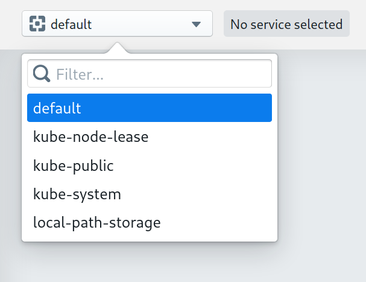

::: {.only}
not (epub or latex or html)

WARNING: You are looking at unreleased Cilium documentation. Please use
the official rendered version released here: <https://docs.cilium.io>
:::

Service Map & Hubble UI[]{#hubble_gsg} {#hubble_ui}
======================================

This tutorial guides you through enabling the Hubble UI to access the
graphical service map.


::: {.note}
::: {.title}
Note
:::

This guide assumes that Cilium has been correctly installed in your
Kubernetes cluster and that Hubble has been enabled. Please see
`k8s_quick_install`{.interpreted-text role="ref"} and
`hubble_setup`{.interpreted-text role="ref"} for more information. If
unsure, run `cilium status` and validate that Cilium and Hubble are up
and running.
:::

Enable the Hubble UI
--------------------

If you have not done so already, enable the Hubble UI by running the
following command:

::: {.tabs}
::: {.group-tab}
Cilium CLI

``` {.shell-session}
cilium hubble enable --ui
🔑 Found existing CA in secret cilium-ca
✨ Patching ConfigMap cilium-config to enable Hubble...
♻️  Restarted Cilium pods
✅ Relay is already deployed
✅ Hubble UI is already deployed
```
:::

::: {.group-tab}
Helm

::: {.parsed-literal}

helm upgrade cilium \\

:   \--namespace \$CILIUM_NAMESPACE \\ \--reuse-values \\ \--set
    hubble.relay.enabled=true \\ \--set hubble.ui.enabled=true
:::
:::

::: {.group-tab}
Helm (Standalone install)

Clusters sometimes come with Cilium, Hubble, and Hubble relay already
installed. When this is the case you can still use Helm to install only
Hubble UI on top of the pre-installed components.

You will need to set `hubble.ui.standalone.enabled` to `true` and
optionally provide a volume to mount Hubble UI client certificates if
TLS is enabled on Hubble Relay server side.

Below is an example deploying Hubble UI as standalone, with client
certificates mounted from a `my-hubble-ui-client-certs` secret:

::: {.parsed-literal}
helm upgrade \--install \--namespace kube-system cilium \--values -
\<\<EOF agent: false operator: enabled: false cni: install: false
hubble: enabled: false relay: \# set this to false as Hubble relay is
already installed enabled: false tls: server: \# set this to true if tls
is enabled on Hubble relay server side enabled: true ui: \# enable
Hubble UI enabled: true standalone: \# enable Hubble UI standalone
deployment enabled: true \# provide a volume containing Hubble relay
client certificates to mount in Hubble UI pod tls: certsVolume:
projected: defaultMode: 0400 sources: - secret: name:
my-hubble-ui-client-certs items: - key: tls.crt path: client.crt - key:
tls.key path: client.key - key: ca.crt path: hubble-relay-ca.crt EOF
:::

Please note that Hubble UI expects the certificate files to be available
under the following paths:

``` {.shell-session}
- name: TLS_RELAY_CA_CERT_FILES
  value: /var/lib/hubble-ui/certs/hubble-relay-ca.crt
- name: TLS_RELAY_CLIENT_CERT_FILE
  value: /var/lib/hubble-ui/certs/client.crt
- name: TLS_RELAY_CLIENT_KEY_FILE
  value: /var/lib/hubble-ui/certs/client.key
```

Keep this in mind when providing the volume containing the certificate.
:::
:::

Open the Hubble UI
------------------

Open the Hubble UI in your browser by running `cilium hubble ui`. It
will automatically set up a port forward to the hubble-ui service in
your Kubernetes cluster and make it available on a local port on your
machine.

``` {.shell-session}
cilium hubble ui
Forwarding from 0.0.0.0:12000 -> 8081
Forwarding from [::]:12000 -> 8081
```

::: {.tip}
::: {.title}
Tip
:::

The above command will block and continue running while the port forward
is active. You can interrupt the command to abort the port forward and
re-run the command to make the UI accessible again.
:::

If your browser has not automatically opened the UI, open the page
<http://localhost:12000> in your browser. You should see a screen with
an invitation to select a namespace, use the namespace selector dropdown
on the left top corner to select a namespace:



In this example, we are deploying the Star Wars demo from the
`gs_http`{.interpreted-text role="ref"} guide. However you can apply the
same techniques to observe application connectivity dependencies in your
own namespace, and clusters for application of any type.

Once the deployment is ready, issue a request from both spaceships to
emulate some traffic.

``` {.shell-session}
$ kubectl exec xwing -- curl -s -XPOST deathstar.default.svc.cluster.local/v1/request-landing
Ship landed
$ kubectl exec tiefighter -- curl -s -XPOST deathstar.default.svc.cluster.local/v1/request-landing
Ship landed
```

These requests will then be displayed in the UI as service dependencies
between the different pods:


In the bottom of the interface, you may also inspect each recent Hubble
flow event in your current namespace individually.

Inspecting a wide variety of network traffic
--------------------------------------------

In order to generate some network traffic, run the connectivity test in
a loop:

``` {.shell-session}
while true; do cilium connectivity test; done 
```

To see the traffic in Hubble, open <http://localhost:12000/cilium-test>
in your browser.
