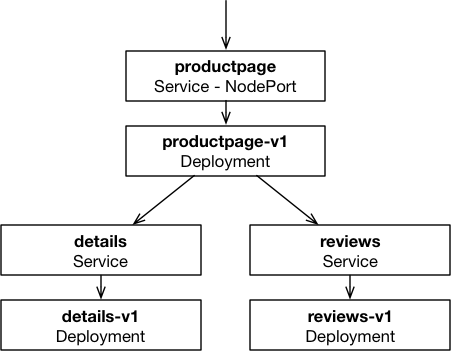
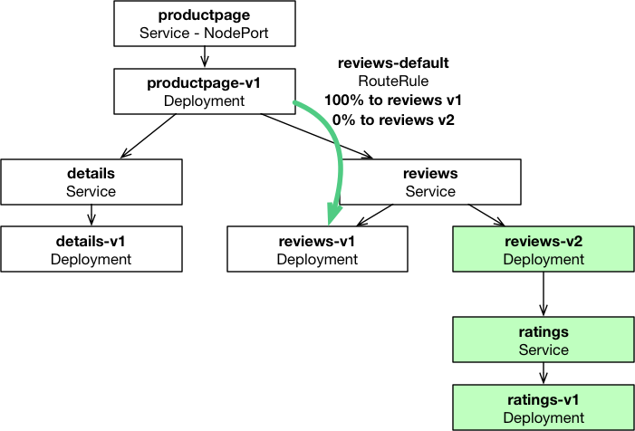
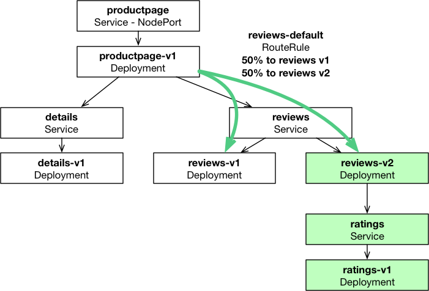
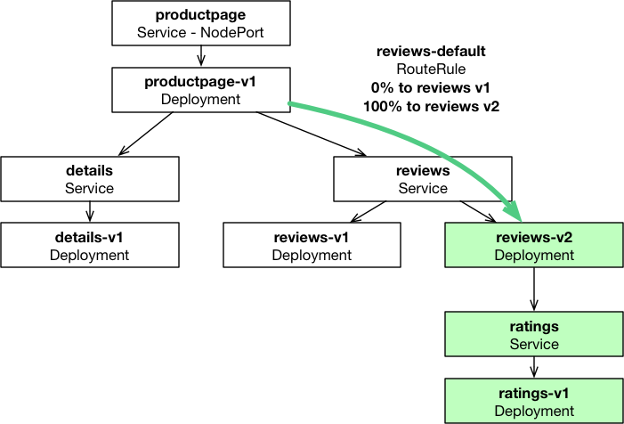
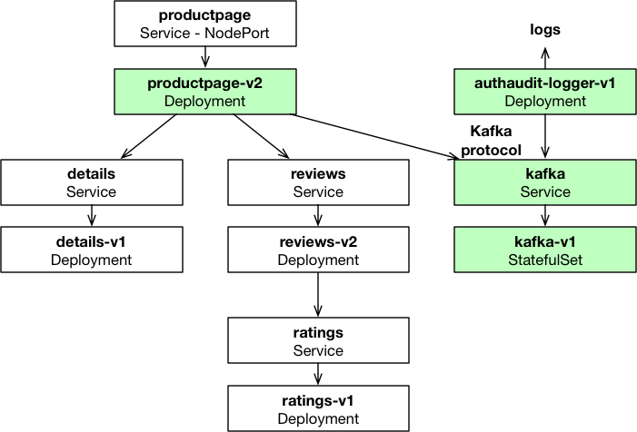

::: {.only}
not (epub or latex or html)

WARNING: You are looking at unreleased Cilium documentation. Please use
the official rendered version released here: <https://docs.cilium.io>
:::

Getting Started Using Istio {#gsg_istio}
===========================

This document serves as an introduction to using Cilium Istio
integration to enforce security policies in Kubernetes micro-services
managed with Istio. It is a detailed walk-through of getting a
single-node Cilium + Istio environment running on your machine.

Cilium\'s Istio integration allows Cilium to enforce HTTP L7 network
policies for mTLS protected traffic within the Istio sidecar proxies.
Note that Istio can also be deployed without Cilium integration by
running a standard version of `istioctl`. In that case Cilium will
enforce HTTP L7 policies outside of the Istio sidecar proxy, but that
will only work if mTLS is not used.

::: {.note}
::: {.title}
Note
:::

If running on minikube, make sure it is using a VM, as Istio ingress
gateway may not be reachable from your host otherwise. You may also need
to up the memory and CPUs available to the minikube VM from the defaults
and/or the instructions provided here for the other GSGs. 5 GB and 4
CPUs should be enough for this GSG (`--vm=true --memory=5120 --cpus=4`).
:::

::: {.note}
::: {.title}
Note
:::

If Cilium is deployed with the kube-proxy replacement, you need to set
`bpf-lb-sock-hostns-only: true` in the deployment yaml directly or via
`hostServices.hostNamespaceOnly` option with Helm. Without this option,
when Cilium does service resolution via socket load balancing, Istio
sidecar will be bypassed, resulting in loss of Istio features including
encryption and telemetry.
:::

Step 2: Install cilium-istioctl
-------------------------------

::: {.note}
::: {.title}
Note
:::

Make sure that Cilium is running in your cluster before proceeding.
:::

Download the [cilium enhanced istioctl version
1.10.4](https://github.com/cilium/istio/releases/tag/1.10.4):

::: {.tabs}
.. group-tab:: Linux (amd64)

``` {.shell-session}
curl -L https://github.com/cilium/istio/releases/download/1.10.4/cilium-istioctl-1.10.4-linux-amd64.tar.gz | tar xz
```

::: {.group-tab}
Linux (arm64)
:::

``` {.shell-session}
curl -L https://github.com/cilium/istio/releases/download/1.10.4/cilium-istioctl-1.10.4-linux-arm64.tar.gz | tar xz
```

::: {.group-tab}
OSX
:::

``` {.shell-session}
curl -L https://github.com/cilium/istio/releases/download/1.10.4/cilium-istioctl-1.10.4-osx.tar.gz | tar xz
```

::: {.group-tab}
OSX (Apple Silicon)
:::

``` {.shell-session}
curl -L https://github.com/cilium/istio/releases/download/1.10.4/cilium-istioctl-1.10.4-osx-arm64.tar.gz | tar xz
```
:::

::: {.note}
::: {.title}
Note
:::

Cilium integration, as presented in this Getting Started Guide, has been
tested with Kubernetes releases 1.17, 1.18, 1.19, 1.20, 1.21, 1.22, 1.23
and 1.24. This Istio release does not work with Kubernetes 1.16 or
older.
:::

Deploy the default Istio configuration profile onto Kubernetes:

``` {.shell-session}
./cilium-istioctl install -y
```

Add a namespace label to instruct Istio to automatically inject Envoy
sidecar proxies when you deploy your application later:

``` {.shell-session}
kubectl label namespace default istio-injection=enabled
```

Step 3: Deploy the Bookinfo Application V1
------------------------------------------

Now that we have Cilium and Istio deployed, we can deploy version `v1`
of the services of the [Istio Bookinfo sample
application](https://istio.io/docs/examples/bookinfo/).

While the upstream [Istio Bookinfo Application example for
Kubernetes](https://istio.io/docs/examples/bookinfo/#if-you-are-running-on-kubernetes)
deploys multiple versions of the Bookinfo application at the same time,
here we first deploy only the version 1.

The BookInfo application is broken into four separate microservices:

-   *productpage*. The productpage microservice calls the details and
    reviews microservices to populate the page.
-   *details*. The details microservice contains book information.
-   *reviews*. The reviews microservice contains book reviews. It also
    calls the ratings microservice.
-   *ratings*. The ratings microservice contains book ranking
    information that accompanies a book review.

In this demo, each specific version of each microservice is deployed
into Kubernetes using separate YAML files which define:

-   A Kubernetes Service.
-   A Kubernetes Deployment specifying the microservice\'s pods,
    specific to each service version.
-   A Cilium Network Policy limiting the traffic to the microservice,
    specific to each service version.

{.align-center}

To deploy the application with manual sidecar injection, run:

::: {.parsed-literal}

for service in productpage-service productpage-v1 details-v1 reviews-v1; do \\

:   kubectl apply -f
    /examples/kubernetes-istio/bookinfo-\${service}.yaml ; done
:::

Check the progress of the deployment (every service should have an
`AVAILABLE` count of `1`):

``` {.shell-session}
$ watch "kubectl get deployments"
NAME             READY   UP-TO-DATE   AVAILABLE   AGE
details-v1       1/1     1            1           12s
productpage-v1   1/1     1            1           13s
reviews-v1       1/1     1            1           12s
```

::: {.only}
not (epub or latex or html)

Notes for Istio debugging: - Set istio proxy to debug or trace mode:
kubectl exec -it \$(kubectl get pod -l app=productpage -o
jsonpath=\'{.items\[0\].metadata.name}\') -c istio-proxy \-- curl -XPOST
<http://127.0.0.1:15000/logging?level=debug> - Check that bpf is
mounted: kubectl exec -it \$(kubectl get pod -l app=productpage -o
jsonpath=\'{.items\[0\].metadata.name}\') -c istio-proxy \-- ls -la
/sys/fs/bpf/tc/globals - Upgrade cilium to a local image (after setting
image pull policy to never): export CILIUM_TAG=my-test-tag docker save
cilium/cilium:\${CILIUM_TAG} -o cilium-\${CILIUM_TAG}.tar scp -i
\$(minikube ssh-key) cilium-\${CILIUM_TAG}.tar docker@\$(minikube ip):.
minikube ssh \"docker image load -i cilium-\${CILIUM_TAG}.tar\" kubectl
-n kube-system set image daemonset/cilium
cilium-agent=docker.io/cilium/cilium:\${CILIUM_TAG}
:::

Create an Istio ingress gateway for the productpage service:

::: {.parsed-literal}
kubectl apply -f /examples/kubernetes-istio/bookinfo-gateway.yaml
:::

To obtain the URL to the frontend productpage service, run:

``` {.shell-session}
export GATEWAY_URL=http://$(minikube ip):$(kubectl -n istio-system get service istio-ingressgateway -o jsonpath='{.spec.ports[?(@.name=="http2")].nodePort}')
export PRODUCTPAGE_URL=${GATEWAY_URL}/productpage
open ${PRODUCTPAGE_URL}
```

Open that URL in your web browser and check that the application has
been successfully deployed. It may take several seconds before all
services become accessible in the Istio service mesh, so you may have
have to reload the page.

Step 4: Canary and Deploy the Reviews Service V2
------------------------------------------------

We will now deploy version `v2` of the `reviews` service. In addition to
providing reviews from readers, `reviews v2` queries a new `ratings`
service for book ratings, and displays each rating as 1 to 5 black
stars.

As a precaution, we will use Istio\'s service routing feature to canary
the `v2` deployment to prevent breaking the end-to-end application
completely if it is faulty.

Before deploying `v2`, to prevent any traffic from being routed to it
for now, we will create this Istio route rules to route 100% of the
`reviews` traffic to `v1`:

::: {.literalinclude}
../../examples/kubernetes-istio/route-rule-reviews-v1.yaml
:::

{.align-center}

Apply this route rule:

::: {.parsed-literal}
kubectl apply -f /examples/kubernetes-istio/route-rule-reviews-v1.yaml
:::

Deploy the `ratings v1` and `reviews v2` services:

::: {.parsed-literal}

for service in ratings-v1 reviews-v2; do \\

:   kubectl apply -f
    /examples/kubernetes-istio/bookinfo-\${service}.yaml ; done
:::

Check the progress of the deployment (every service should have an
`AVAILABLE` count of `1`):

``` {.shell-session}
$ watch "kubectl get deployments"
NAME             READY   UP-TO-DATE   AVAILABLE   AGE
details-v1       1/1     1            1           17m
productpage-v1   1/1     1            1           17m
ratings-v1       1/1     1            1           69s
reviews-v1       1/1     1            1           17m
reviews-v2       1/1     1            1           68s
```

Check in your web browser that no stars are appearing in the Book
Reviews, even after refreshing the page several times. This indicates
that all reviews are retrieved from `reviews v1` and none from
`reviews v2`.

{.align-center}

The `ratings-v1` CiliumNetworkPolicy explicitly whitelists access to the
`ratings` API only from `productpage` and `reviews v2`:

::: {.literalinclude}
../../examples/kubernetes-istio/bookinfo-ratings-v1-policy.yaml
:::

Check that `reviews v1` may not be able to access the `ratings` service,
even if it were compromised or suffered from a bug, by running `curl`
from within the pod:

::: {.note}
::: {.title}
Note
:::

All traffic from `reviews v1` to `ratings` is blocked, so the connection
attempt fails after the connection timeout.
:::

``` {.shell-session}
$ export POD_REVIEWS_V1=`kubectl get pods -l app=reviews,version=v1 -o jsonpath='{.items[0].metadata.name}'`
$ kubectl exec ${POD_REVIEWS_V1} -c istio-proxy -ti -- curl --connect-timeout 5 --fail http://ratings:9080/ratings/0
curl: (28) Connection timed out after 5001 milliseconds
command terminated with exit code 28
```

Update the Istio route rule to send 50% of `reviews` traffic to `v1` and
50% to `v2`:

::: {.literalinclude}
../../examples/kubernetes-istio/route-rule-reviews-v1-v2.yaml
:::

{.align-center}

Apply this route rule:

::: {.parsed-literal}
kubectl apply -f
/examples/kubernetes-istio/route-rule-reviews-v1-v2.yaml
:::

Check in your web browser that stars are appearing in the Book Reviews
roughly 50% of the time. This may require refreshing the page for a few
seconds to observe. Queries to `reviews v2` result in reviews containing
ratings displayed as black stars:

{.align-center}

Finally, update the route rule to send 100% of `reviews` traffic to
`v2`:

::: {.literalinclude}
../../examples/kubernetes-istio/route-rule-reviews-v2.yaml
:::

{.align-center}

Apply this route rule:

::: {.parsed-literal}
kubectl apply -f /examples/kubernetes-istio/route-rule-reviews-v2.yaml
:::

Refresh the product page in your web browser several times to verify
that stars are now appearing in the Book Reviews on every page refresh.
All the reviews are now retrieved from `reviews v2` and none from
`reviews v1`.

Step 5: Deploy the Product Page Service V2
------------------------------------------

We will now deploy version `v2` of the `productpage` service, which
brings two changes:

-   It is deployed with a more restrictive CiliumNetworkPolicy, which
    restricts access to a subset of the HTTP URLs, at Layer-7.
-   It implements a new authentication audit log into Kafka.

{.align-center}

The policy for `v1` currently allows read access to the full HTTP REST
API, under the `/api/v1` HTTP URI path:

-   `/api/v1/products`: Returns the list of books and their details.
-   `/api/v1/products/<id>`: Returns details about a specific book.
-   `/api/v1/products/<id>/reviews`: Returns reviews for a specific
    book.
-   `/api/v1/products/<id>/ratings`: Returns ratings for a specific
    book.

Check that the full REST API is currently accessible in `v1` and returns
valid JSON data:

``` {.shell-session}
for APIPATH in /api/v1/products /api/v1/products/0 /api/v1/products/0/reviews /api/v1/products/0/ratings; do echo ; curl -s -S "${GATEWAY_URL}${APIPATH}" ; echo ; done
```

The output will be similar to this:

    [{"descriptionHtml": "<a href=\"https://en.wikipedia.org/wiki/The_Comedy_of_Errors\">Wikipedia Summary</a>: The Comedy of Errors is one of <b>William Shakespeare's</b> early plays. It is his shortest and one of his most farcical comedies, with a major part of the humour coming from slapstick and mistaken identity, in addition to puns and word play.", "id": 0, "title": "The Comedy of Errors"}]

    {"publisher": "PublisherA", "language": "English", "author": "William Shakespeare", "id": 0, "ISBN-10": "1234567890", "ISBN-13": "123-1234567890", "year": 1595, "type": "paperback", "pages": 200}

    {"reviews": [{"reviewer": "Reviewer1", "rating": {"color": "black", "stars": 5}, "text": "An extremely entertaining play by Shakespeare. The slapstick humour is refreshing!"}, {"reviewer": "Reviewer2", "rating": {"color": "black", "stars": 4}, "text": "Absolutely fun and entertaining. The play lacks thematic depth when compared to other plays by Shakespeare."}], "id": "0"}

    {"ratings": {"Reviewer2": 4, "Reviewer1": 5}, "id": 0}

We realized that the REST API to get the book reviews and ratings was
meant only for consumption by other internal services, and will be
blocked from external clients using the updated Layer-7
CiliumNetworkPolicy in `productpage v2`, i.e. only the
`/api/v1/products` and `/api/v1/products/<id>` HTTP URLs will be
whitelisted:

::: {.literalinclude}
../../examples/kubernetes-istio/bookinfo-productpage-v2-policy.yaml
:::

Because `productpage v2` sends messages into Kafka, we must first deploy
a Kafka broker:

::: {.parsed-literal}
kubectl apply -f /examples/kubernetes-istio/kafka-v1-destrule.yaml
:::

::: {.parsed-literal}
kubectl apply -f /examples/kubernetes-istio/kafka-v1.yaml
:::

Wait until the `kafka-v1-0` pod is ready, i.e. until it has a `READY`
count of `1/1`:

``` {.shell-session}
$ watch "kubectl get pods -l app=kafka"
NAME         READY     STATUS    RESTARTS   AGE
kafka-v1-0   1/1       Running   0          21m
```

Create the `authaudit` Kafka topic, which will be used by
`productpage v2`:

``` {.shell-session}
kubectl exec kafka-v1-0 -c kafka -- bash -c '/opt/kafka_2.11-0.10.1.0/bin/kafka-topics.sh --zookeeper localhost:2181/kafka --create --topic authaudit --partitions 1 --replication-factor 1'
```

We are now ready to deploy `productpage v2`.

Create the `productpage v2` service and its updated CiliumNetworkPolicy
and delete `productpage v1`:

::: {.parsed-literal}
kubectl apply -f /examples/kubernetes-istio/bookinfo-productpage-v2.yaml
:::

::: {.parsed-literal}
kubectl delete -f
/examples/kubernetes-istio/bookinfo-productpage-v1.yaml
:::

`productpage v2` implements an authorization audit logging. On every
user login or logout, it produces into Kafka topic `authaudit` a
JSON-formatted message which contains the following information:

-   event: `login` or `logout`
-   username
-   client IP address
-   timestamp

To observe the Kafka messages sent by `productpage`, we will run an
additional `authaudit-logger` service. This service fetches and prints
out all messages from the `authaudit` Kafka topic. Start this service:

::: {.parsed-literal}
kubectl apply -f /examples/kubernetes-istio/authaudit-logger-v1.yaml
:::

Check the progress of the deployment (every service should have an
`AVAILABLE` count of `1`):

``` {.shell-session}
$ watch "kubectl get deployments"
NAME                  READY   UP-TO-DATE   AVAILABLE   AGE
authaudit-logger-v1   1/1     1            1           41s
details-v1            1/1     1            1           37m
productpage-v2        1/1     1            1           4m47s
ratings-v1            1/1     1            1           20m
reviews-v1            1/1     1            1           37m
reviews-v2            1/1     1            1           20m
```

Check that the product REST API is still accessible, and that Cilium now
denies at Layer-7 any access to the reviews and ratings REST API:

``` {.shell-session}
for APIPATH in /api/v1/products /api/v1/products/0 /api/v1/products/0/reviews /api/v1/products/0/ratings; do echo ; curl -s -S "${GATEWAY_URL}${APIPATH}" ; echo ; done
```

The output will be similar to this:

    [{"descriptionHtml": "<a href=\"https://en.wikipedia.org/wiki/The_Comedy_of_Errors\">Wikipedia Summary</a>: The Comedy of Errors is one of <b>William Shakespeare's</b> early plays. It is his shortest and one of his most farcical comedies, with a major part of the humour coming from slapstick and mistaken identity, in addition to puns and word play.", "id": 0, "title": "The Comedy of Errors"}]

    {"publisher": "PublisherA", "language": "English", "author": "William Shakespeare", "id": 0, "ISBN-10": "1234567890", "ISBN-13": "123-1234567890", "year": 1595, "type": "paperback", "pages": 200}

    Access denied


    Access denied

This demonstrated that requests to the `/api/v1/products/<id>/reviews`
and `/api/v1/products/<id>/ratings` URIs now result in Cilium returning
`HTTP 403 Forbidden` HTTP responses.

Every login and logout on the product page will result in a line in this
service\'s log. Note that you need to log in/out using the
`sign in`/`sign out` element on the bookinfo web page. When you do, you
can observe these kind of audit logs:

``` {.shell-session}
export POD_LOGGER_V1=`kubectl get pods -l app=authaudit-logger,version=v1 -o jsonpath='{.items[0].metadata.name}'`
```

``` {.shell-session}
$ kubectl logs ${POD_LOGGER_V1} -c authaudit-logger
...
{"timestamp": "2017-12-04T09:34:24.341668", "remote_addr": "10.15.28.238", "event": "login", "user": "richard"}
{"timestamp": "2017-12-04T09:34:40.943772", "remote_addr": "10.15.28.238", "event": "logout", "user": "richard"}
{"timestamp": "2017-12-04T09:35:03.096497", "remote_addr": "10.15.28.238", "event": "login", "user": "gilfoyle"}
{"timestamp": "2017-12-04T09:35:08.777389", "remote_addr": "10.15.28.238", "event": "logout", "user": "gilfoyle"}
```

As you can see, the user-identifiable information sent by `productpage`
in every Kafka message is sensitive, so access to this Kafka topic must
be protected using Cilium. The CiliumNetworkPolicy configured on the
Kafka broker enforces that:

-   only `productpage v2` is allowed to produce messages into the
    `authaudit` topic;
-   only `authaudit-logger` can fetch messages from this topic;
-   no service can access any other topic.

::: {.literalinclude}
../../examples/kubernetes-istio/kafka-v1-policy.yaml
:::

Check that Cilium prevents the `authaudit-logger` service from writing
into the `authaudit` topic (enter a message followed by ENTER, e.g.
`test message`)

::: {.note}
::: {.title}
Note
:::

Note that the error message may take a short time to appear.
:::

::: {.note}
::: {.title}
Note
:::

You can terminate the command with a single `<CTRL>-d`.
:::

``` {.shell-session}
$ kubectl exec ${POD_LOGGER_V1} -c authaudit-logger -ti -- /opt/kafka_2.11-0.10.1.0/bin/kafka-console-producer.sh --broker-list=kafka:9092 --topic=authaudit
test message
[2017-12-07 02:13:47,020] ERROR Error when sending message to topic authaudit with key: null, value: 12 bytes with error: (org.apache.kafka.clients.producer.internals.ErrorLoggingCallback)
org.apache.kafka.common.errors.TopicAuthorizationException: Not authorized to access topics: [authaudit]
```

This demonstrated that Cilium sent a response with an authorization
error for any `Produce` request from this service.

Create another topic named `credit-card-payments`, meant to transmit
highly-sensitive credit card payment requests:

``` {.shell-session}
$ kubectl exec kafka-v1-0 -c kafka -- bash -c '/opt/kafka_2.11-0.10.1.0/bin/kafka-topics.sh --zookeeper localhost:2181/kafka --create --topic credit-card-payments --partitions 1 --replication-factor 1'
```

Check that Cilium prevents the `authaudit-logger` service from fetching
messages from this topic:

``` {.shell-session}
$ kubectl exec ${POD_LOGGER_V1} -c authaudit-logger -ti -- /opt/kafka_2.11-0.10.1.0/bin/kafka-console-consumer.sh --bootstrap-server=kafka:9092 --topic=credit-card-payments
[2017-12-07 03:08:54,513] WARN Not authorized to read from topic credit-card-payments. (org.apache.kafka.clients.consumer.internals.Fetcher)
[2017-12-07 03:08:54,517] ERROR Error processing message, terminating consumer process:  (kafka.tools.ConsoleConsumer$)
org.apache.kafka.common.errors.TopicAuthorizationException: Not authorized to access topics: [credit-card-payments]
Processed a total of 0 messages
```

This demonstrated that Cilium sent a response with an authorization
error for any `Fetch` request from this service for any topic other than
`authaudit`.

::: {.note}
::: {.title}
Note
:::

At present, the above command may also result in an error message.
:::

Step 6: Clean Up
----------------

You have now installed Cilium and Istio, deployed a demo app, and tested
both Cilium\'s L3-L7 network security policies and Istio\'s service
route rules. To clean up, run:

``` {.shell-session}
minikube delete
```

After this, you can re-run the tutorial from Step 0.
