::: {.only}
not (epub or latex or html)

WARNING: You are looking at unreleased Cilium documentation. Please use
the official rendered version released here: <https://docs.cilium.io>
:::

Installation using Rancher
==========================

Pre-Requisites
--------------

[Rancher Version 2.x](https://rancher.com/docs/rancher/v2.x/en/)

Create a New Cluster
--------------------

In Rancher UI, navigate to the Clusters page. In the top right, click on
the `Add Cluster` box to create a new cluster.

On the Add Cluster page select to create a new cluster from
`Existing Nodes`:

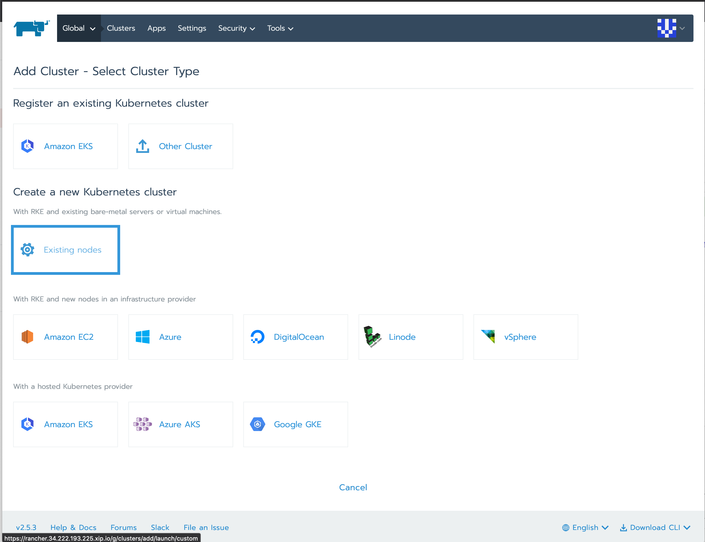

On the `Add Cluster` page that opens, provide a name for the cluster.
Next to the `Cluster Options` section click the box to `Edit as YAML`.
The configuration for the cluster will open up in an editor in the
window.

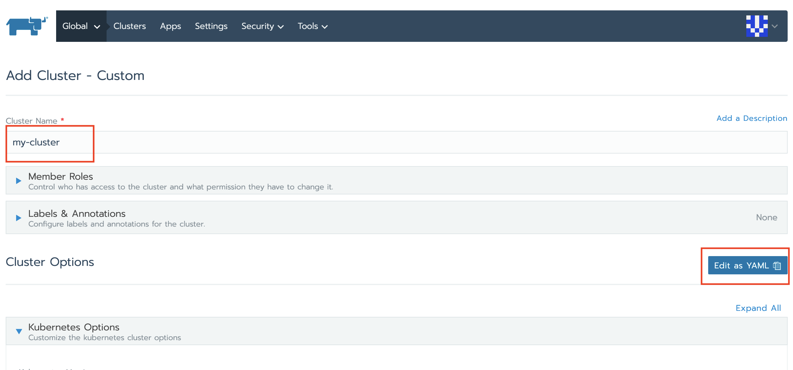

Remove all configuration pertaining to the default network plugin:

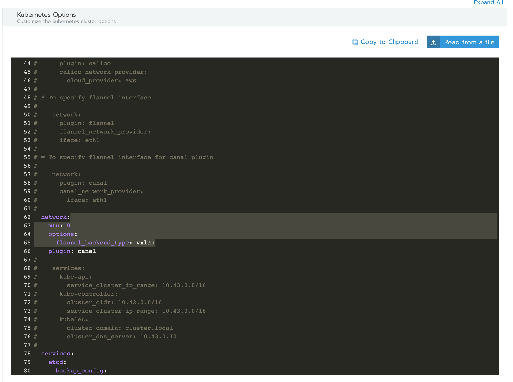

Ensure that network plugin type `none` is specified:

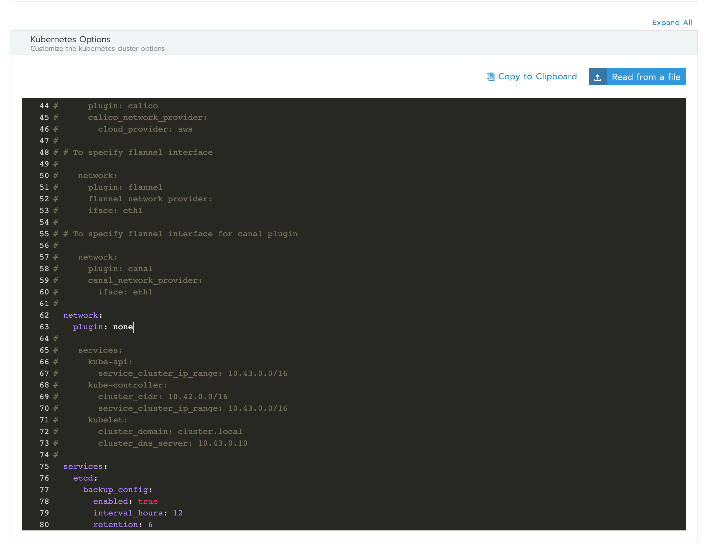

Make any additional changes to the configuration that are appropriate
for your environment. When you are ready, click `Create` and Rancher
will create the cluster in the `Provisioning` state.

Rancher will also present you with instructions on how to add nodes to
the cluster:

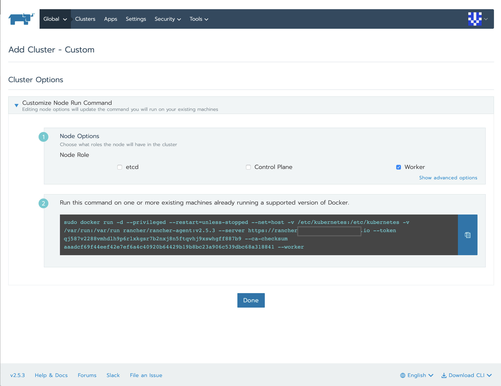

Next, add nodes to the cluster using the Rancher-provided Docker
commands. Be sure to add the appropriate number of nodes required for
your cluster. After a few minutes, you will see that the Nodes overview
will show an error message in the Rancher UI:

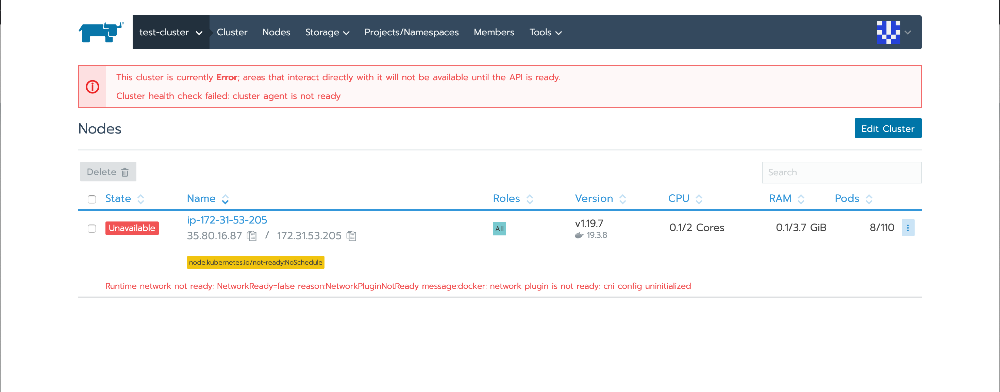

This error is expected. The Kubernetes components are not able to fully
communicate with each other because a CNI plugin has not been installed
yet.

In the Rancher UI, navigate to `Tools` -\> `Catalogs` and click the
`Add Catalog` button:

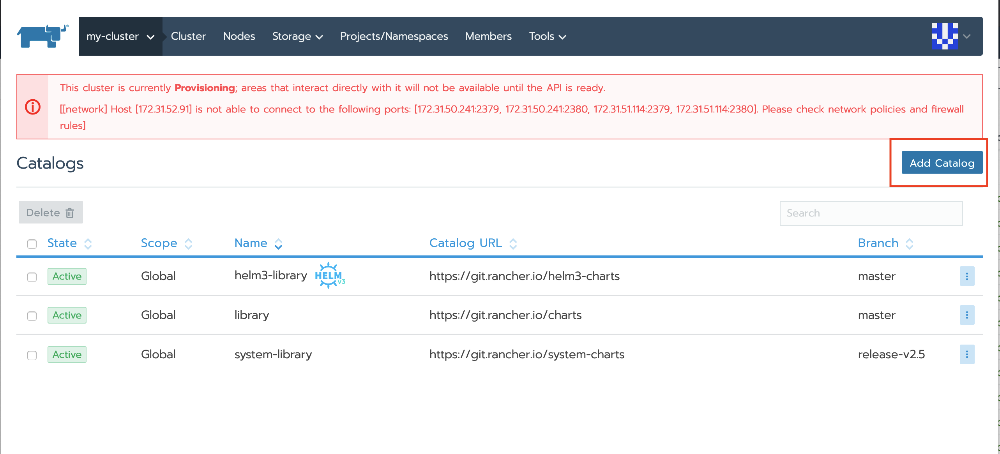

In the window that opens, add the official Cilium Helm v3 chart
repository to the Rancher catalog:

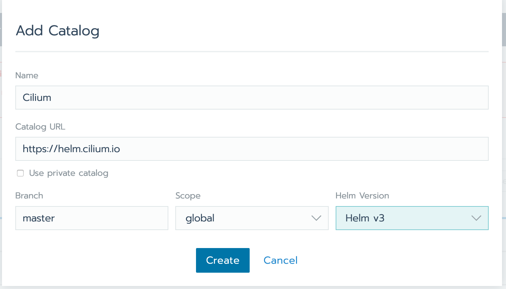

Once added, you should see the Cilium repository in the catalog list:

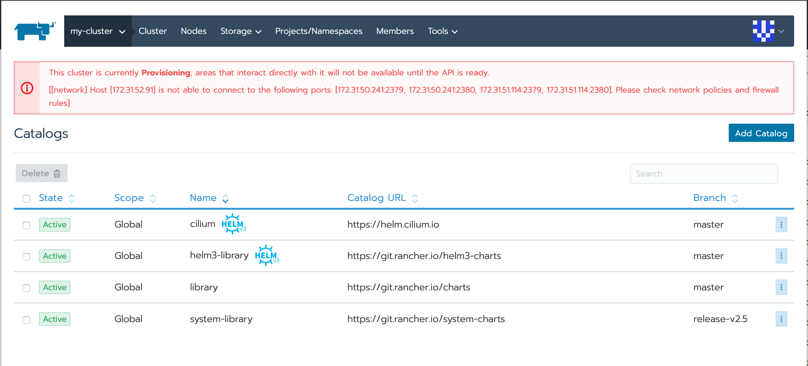

Navigate to the Global Apps list and click the button to `Launch` an
application:

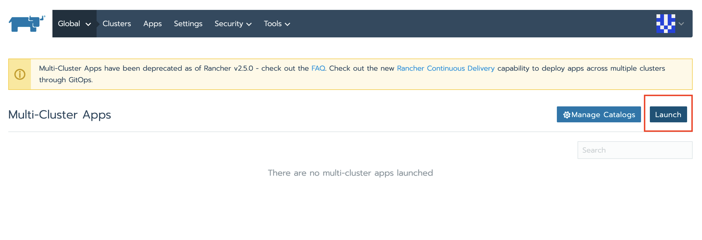

Provide a name for the application and select the System project in your
cluster as the application target:

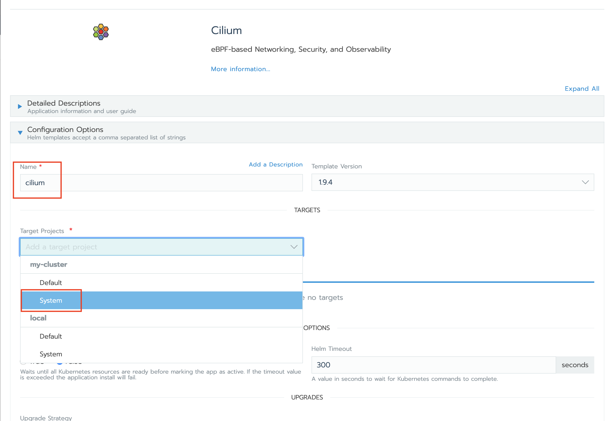

Be sure to configure the application to have cluster-wide scope:

Configure any additional values for the Cilium chart and click `Next`.
The application should deploy within the target cluster and project.

After a few minutes, you should see all nodes as active, and proper
deployments of all Cilium objects.

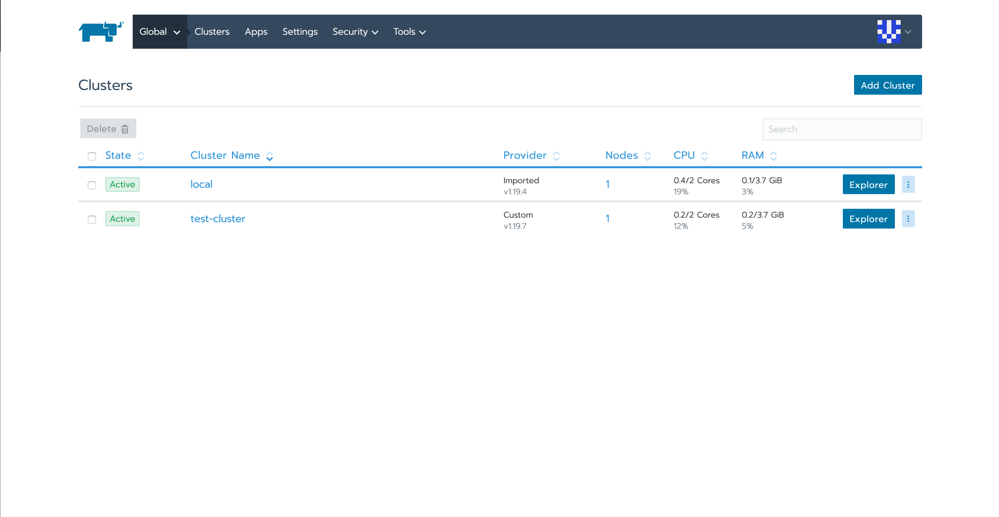
