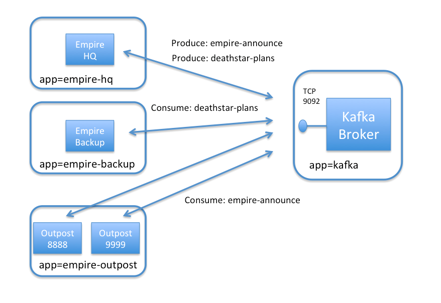
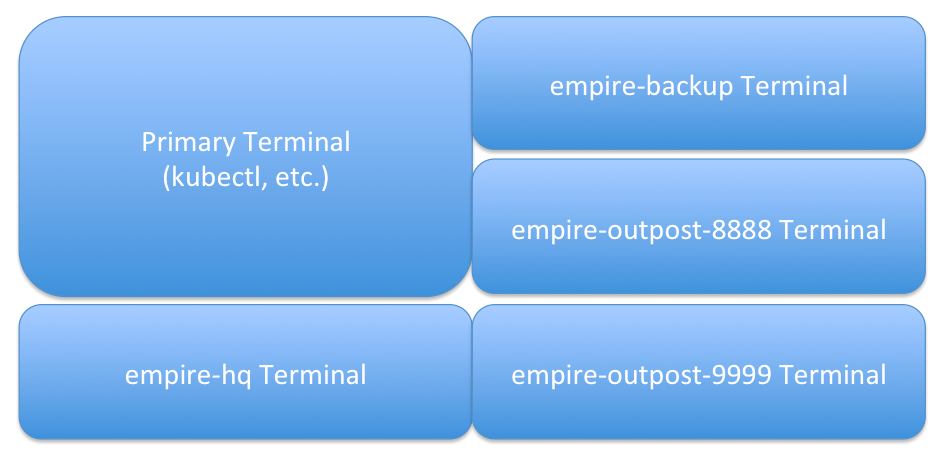
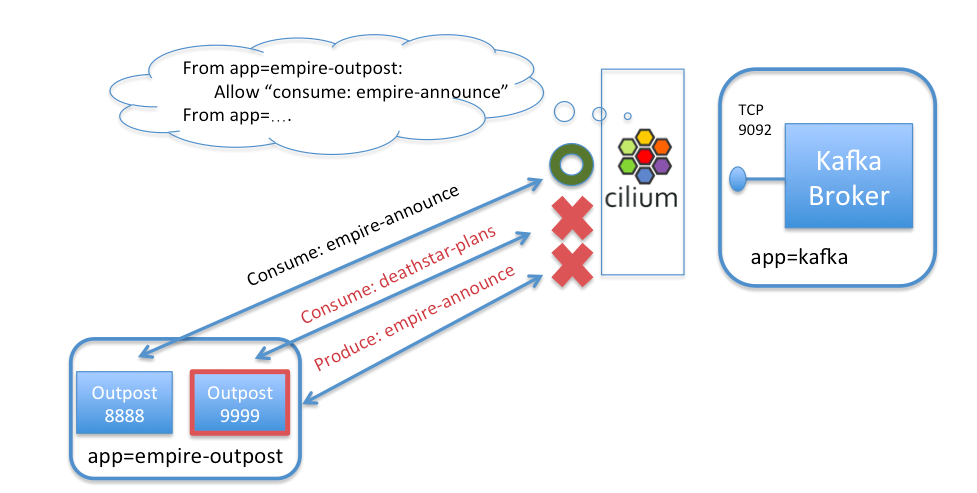

::: {.only}
not (epub or latex or html)

WARNING: You are looking at unreleased Cilium documentation. Please use
the official rendered version released here: <https://docs.cilium.io>
:::

Securing a Kafka cluster {#gs_kafka}
========================

This document serves as an introduction to using Cilium to enforce
Kafka-aware security policies. It is a detailed walk-through of getting
a single-node Cilium environment running on your machine. It is designed
to take 15-30 minutes.

Deploy the Demo Application
---------------------------

Now that we have Cilium deployed and `kube-dns` operating correctly we
can deploy our demo Kafka application. Since our first demo of Cilium +
HTTP-aware security policies was Star Wars-themed we decided to do the
same for Kafka. While the [HTTP-aware Cilium Star Wars
demo](https://cilium.io/blog/2017/5/4/demo-may-the-force-be-with-you/)
showed how the Galactic Empire used HTTP-aware security policies to
protect the Death Star from the Rebel Alliance, this Kafka demo shows
how the lack of Kafka-aware security policies allowed the Rebels to
steal the Death Star plans in the first place.

Kafka is a powerful platform for passing datastreams between different
components of an application. A cluster of \"Kafka brokers\" connect
nodes that \"produce\" data into a data stream, or \"consume\" data from
a datastream. Kafka refers to each datastream as a \"topic\". Because
scalable and highly-available Kafka clusters are non-trivial to run, the
same cluster of Kafka brokers often handles many different topics at
once (read this [Introduction to Kafka](https://kafka.apache.org/intro)
for more background).

In our simple example, the Empire uses a Kafka cluster to handle two
different topics:

-   *empire-announce* : Used to broadcast announcements to sites spread
    across the galaxy
-   *deathstar-plans* : Used by a small group of sites coordinating on
    building the ultimate battlestation.

To keep the setup small, we will just launch a small number of pods to
represent this setup:

-   *kafka-broker* : A single pod running Kafka and Zookeeper
    representing the Kafka cluster (label app=kafka).
-   *empire-hq* : A pod representing the Empire\'s Headquarters, which
    is the only pod that should produce messages to *empire-announce* or
    *deathstar-plans* (label app=empire-hq).
-   *empire-backup* : A secure backup facility located in
    [Scarif](https://starwars.fandom.com/wiki/Scarif_vault) , which is
    allowed to \"consume\" from the secret *deathstar-plans* topic
    (label app=empire-backup).
-   *empire-outpost-8888* : A random outpost in the empire. It needs to
    \"consume\" messages from the *empire-announce* topic (label
    app=empire-outpost).
-   *empire-outpost-9999* : Another random outpost in the empire that
    \"consumes\" messages from the *empire-announce* topic (label
    app=empire-outpost).

All pods other than *kafka-broker* are Kafka clients, which need access
to the *kafka-broker* container on TCP port 9092 in order to send Kafka
protocol messages.



The file `kafka-sw-app.yaml` contains a Kubernetes Deployment for each
of the pods described above, as well as a Kubernetes Service for both
Kafka and Zookeeper.

::: {.parsed-literal}
\$ kubectl create -f /examples/kubernetes-kafka/kafka-sw-app.yaml
deployment \"kafka-broker\" created deployment \"zookeeper\" created
service \"zook\" created service \"kafka-service\" created deployment
\"empire-hq\" created deployment \"empire-outpost-8888\" created
deployment \"empire-outpost-9999\" created deployment \"empire-backup\"
created
:::

Kubernetes will deploy the pods and service in the background. Running
`kubectl get svc,pods` will inform you about the progress of the
operation. Each pod will go through several states until it reaches
`Running` at which point the setup is ready.

``` {.shell-session}
$ kubectl get svc,pods
NAME            TYPE        CLUSTER-IP      EXTERNAL-IP   PORT(S)    AGE
kafka-service   ClusterIP   None            <none>        9092/TCP   2m
kubernetes      ClusterIP   10.96.0.1       <none>        443/TCP    10m
zook            ClusterIP   10.97.250.131   <none>        2181/TCP   2m

NAME                                   READY     STATUS    RESTARTS   AGE
empire-backup-6f4567d5fd-gcrvg         1/1       Running   0          2m
empire-hq-59475b4b64-mrdww             1/1       Running   0          2m
empire-outpost-8888-78dffd49fb-tnnhf   1/1       Running   0          2m
empire-outpost-9999-7dd9fc5f5b-xp6jw   1/1       Running   0          2m
kafka-broker-b874c78fd-jdwqf           1/1       Running   0          2m
zookeeper-85f64b8cd4-nprck             1/1       Running   0          2m
```

Setup Client Terminals
----------------------

First we will open a set of windows to represent the different Kafka
clients discussed above. For consistency, we recommend opening them in
the pattern shown in the image below, but this is optional.



In each window, use copy-paste to have each terminal provide a shell
inside each pod.

empire-hq terminal:

``` {.shell-session}
$ HQ_POD=$(kubectl get pods -l app=empire-hq -o jsonpath='{.items[0].metadata.name}') && kubectl exec -it $HQ_POD -- sh -c "PS1=\"empire-hq $\" /bin/bash"
```

empire-backup terminal:

``` {.shell-session}
$ BACKUP_POD=$(kubectl get pods -l app=empire-backup -o jsonpath='{.items[0].metadata.name}') && kubectl exec -it $BACKUP_POD -- sh -c "PS1=\"empire-backup $\" /bin/bash"
```

outpost-8888 terminal:

``` {.shell-session}
$ OUTPOST_8888_POD=$(kubectl get pods -l outpostid=8888 -o jsonpath='{.items[0].metadata.name}') && kubectl exec -it $OUTPOST_8888_POD -- sh -c "PS1=\"outpost-8888 $\" /bin/bash"
```

outpost-9999 terminal:

``` {.shell-session}
$ OUTPOST_9999_POD=$(kubectl get pods -l outpostid=9999 -o jsonpath='{.items[0].metadata.name}') && kubectl exec -it $OUTPOST_9999_POD -- sh -c "PS1=\"outpost-9999 $\" /bin/bash"
```

Test Basic Kafka Produce & Consume
----------------------------------

First, let\'s start the consumer clients listening to their respective
Kafka topics. All of the consumer commands below will hang
intentionally, waiting to print data they consume from the Kafka topic:

In the *empire-backup* window, start listening on the top-secret
*deathstar-plans* topic:

``` {.shell-session}
$ ./kafka-consume.sh --topic deathstar-plans
```

In the *outpost-8888* window, start listening to *empire-announcement*:

``` {.shell-session}
$ ./kafka-consume.sh --topic empire-announce
```

Do the same in the *outpost-9999* window:

``` {.shell-session}
$ ./kafka-consume.sh --topic empire-announce
```

Now from the *empire-hq*, first produce a message to the
*empire-announce* topic:

``` {.shell-session}
$ echo "Happy 40th Birthday to General Tagge" | ./kafka-produce.sh --topic empire-announce
```

This message will be posted to the *empire-announce* topic, and shows up
in both the *outpost-8888* and *outpost-9999* windows who consume that
topic. It will not show up in *empire-backup*.

*empire-hq* can also post a version of the top-secret deathstar plans to
the *deathstar-plans* topic:

``` {.shell-session}
$ echo "deathstar reactor design v3" | ./kafka-produce.sh --topic deathstar-plans
```

This message shows up in the *empire-backup* window, but not for the
outposts.

Congratulations, Kafka is working as expected :)

The Danger of a Compromised Kafka Client
----------------------------------------

But what if a rebel spy gains access to any of the remote outposts that
act as Kafka clients? Since every client has access to the Kafka broker
on port 9092, it can do some bad stuff. For starters, the outpost
container can actually switch roles from a consumer to a producer,
sending \"malicious\" data to all other consumers on the topic.

To prove this, kill the existing `kafka-consume.sh` command in the
outpost-9999 window by typing control-C and instead run:

``` {.shell-session}
$ echo "Vader Booed at Empire Karaoke Party" | ./kafka-produce.sh --topic empire-announce
```

Uh oh! Outpost-8888 and all of the other outposts in the empire have now
received this fake announcement.

But even more nasty from a security perspective is that the outpost
container can access any topic on the kafka-broker.

In the outpost-9999 container, run:

``` {.shell-session}
$ ./kafka-consume.sh --topic deathstar-plans
"deathstar reactor design v3"
```

We see that any outpost can actually access the secret deathstar plans.
Now we know how the rebels got access to them!

Securing Access to Kafka with Cilium
------------------------------------

Obviously, it would be much more secure to limit each pod\'s access to
the Kafka broker to be least privilege (i.e., only what is needed for
the app to operate correctly and nothing more).

We can do that with the following Cilium security policy. As with Cilium
HTTP policies, we can write policies that identify pods by labels, and
then limit the traffic in/out of this pod. In this case, we\'ll create a
policy that identifies the exact traffic that should be allowed to reach
the Kafka broker, and deny the rest.

As an example, a policy could limit containers with label
*app=empire-outpost* to only be able to consume topic *empire-announce*,
but would block any attempt by a compromised container (e.g.,
empire-outpost-9999) from producing to *empire-announce* or consuming
from *deathstar-plans*.



Here is the *CiliumNetworkPolicy* rule that limits access of pods with
label *app=empire-outpost* to only consume on topic *empire-announce*:

::: {.literalinclude}
../../examples/policies/getting-started/kafka.yaml
:::

A *CiliumNetworkPolicy* contains a list of rules that define allowed
requests, meaning that requests that do not match any rules are denied
as invalid.

The above rule applies to inbound (i.e., \"ingress\") connections to
kafka-broker pods (as indicated by \"app: kafka\" in the
\"endpointSelector\" section). The rule will apply to connections from
pods with label \"app: empire-outpost\" as indicated by the
\"fromEndpoints\" section. The rule explicitly matches Kafka connections
destined to TCP 9092, and allows consume/produce actions on various
topics of interest. For example we are allowing *consume* from topic
*empire-announce* in this case.

The full policy adds two additional rules that permit the legitimate
\"produce\" (topic *empire-announce* and topic *deathstar-plans*) from
*empire-hq* and the legitimate consume (topic = \"deathstar-plans\")
from *empire-backup*. The full policy can be reviewed by opening the URL
in the command below in a browser.

Apply this Kafka-aware network security policy using `kubectl` in the
main window:

::: {.parsed-literal}
\$ kubectl create -f
/examples/kubernetes-kafka/kafka-sw-security-policy.yaml
:::

If we then again try to produce a message from outpost-9999 to
*empire-annnounce*, it is denied. Type control-c and then run:

``` {.shell-session}
$ echo "Vader Trips on His Own Cape" | ./kafka-produce.sh --topic empire-announce
>>[2018-04-10 23:50:34,638] ERROR Error when sending message to topic empire-announce with key: null, value: 27 bytes with error: (org.apache.kafka.clients.producer.internals.ErrorLoggingCallback)
org.apache.kafka.common.errors.TopicAuthorizationException: Not authorized to access topics: [empire-announce]
```

This is because the policy does not allow messages with role =
\"produce\" for topic \"empire-announce\" from containers with label app
= empire-outpost. Its worth noting that we don\'t simply drop the
message (which could easily be confused with a network error), but
rather we respond with the Kafka access denied error (similar to how
HTTP would return an error code of 403 unauthorized).

Likewise, if the outpost container ever tries to consume from topic
*deathstar-plans*, it is denied, as role = consume is only allowed for
topic *empire-announce*.

To test, from the outpost-9999 terminal, run:

``` {.shell-session}
$./kafka-consume.sh --topic deathstar-plans
[2018-04-10 23:51:12,956] WARN Error while fetching metadata with correlation id 2 : {deathstar-plans=TOPIC_AUTHORIZATION_FAILED} (org.apache.kafka.clients.NetworkClient)
```

This is blocked as well, thanks to the Cilium network policy. Imagine
how different things would have been if the empire had been using Cilium
from the beginning!

Clean Up
--------

You have now installed Cilium, deployed a demo app, and tested both L7
Kafka-aware network security policies. To clean up, run:

::: {.parsed-literal}
\$ kubectl delete -f /examples/kubernetes-kafka/kafka-sw-app.yaml \$
kubectl delete cnp secure-empire-kafka
:::

After this, you can re-run the tutorial from Step 1.
