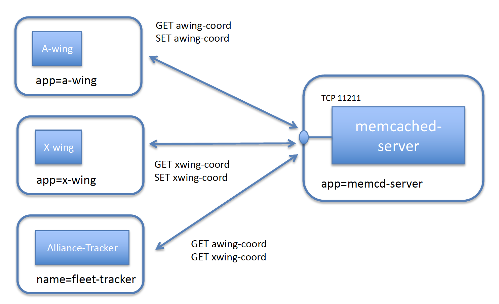
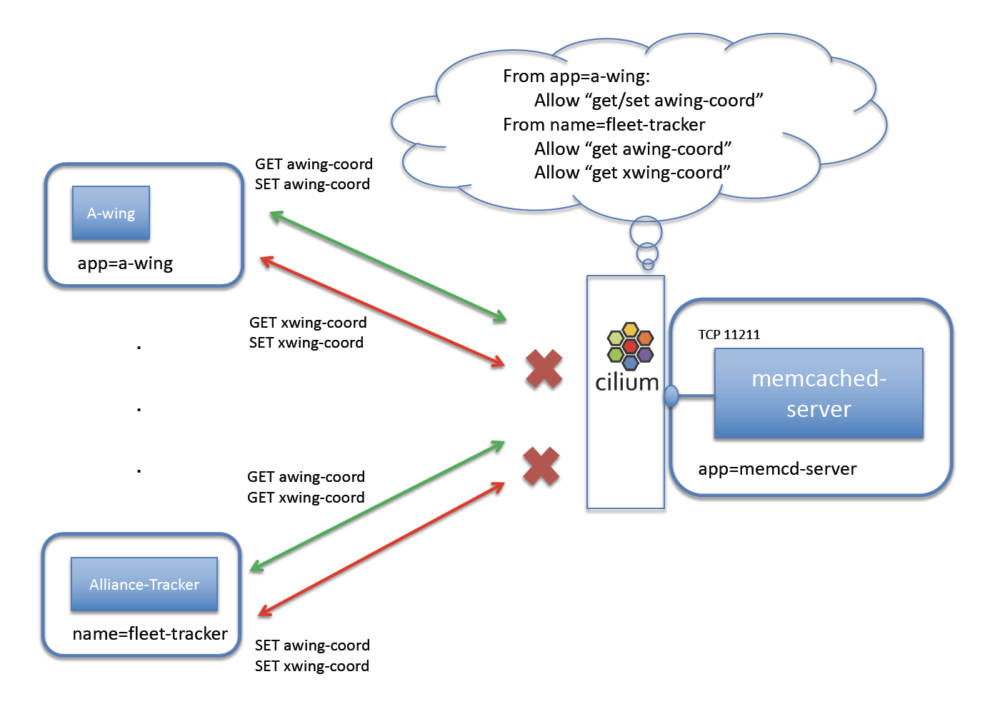

::: {.only}
not (epub or latex or html)

WARNING: You are looking at unreleased Cilium documentation. Please use
the official rendered version released here: <https://docs.cilium.io>
:::

Getting Started Securing Memcached
==================================

This document serves as an introduction to using Cilium to enforce
memcached-aware security policies. It walks through a single-node Cilium
environment running on your machine. It is designed to take 15-30
minutes.

**NOTE:** memcached-aware policy support is still in beta. It is not yet
ready for production use. Additionally, the memcached-specific policy
language is highly likely to change in a future Cilium version.

[Memcached](https://memcached.org/) is a high performance, distributed
memory object caching system. It\'s simple yet powerful, and used by
dynamic web applications to alleviate database load. Memcached is
designed to work efficiently for a very large number of open
connections. Thus, clients are encouraged to cache their connections
rather than the overhead of reopening TCP connections every time they
need to store or retrieve data. Multiple clients can benefit from this
distributed cache\'s performance benefits.

There are two kinds of data sent in the memcache protocol: text lines
and unstructured (binary) data. We will demonstrate clients using both
types of protocols to communicate with a memcached server.

Step 2: Deploy the Demo Application
-----------------------------------

Now that we have Cilium deployed and `kube-dns` operating correctly we
can deploy our demo memcached application. Since our first [HTTP-aware
Cilium
demo](https://cilium.io/blog/2017/5/4/demo-may-the-force-be-with-you/)
was based on Star Wars, we continue with the theme for the memcached
demo as well.

Ever wonder how the Alliance Fleet manages the changing positions of
their ships? The Alliance Fleet uses memcached to store the coordinates
of their ships. The Alliance Fleet leverages the memcached-svc service
implemented as a memcached server. Each ship in the fleet constantly
updates its coordinates and has the ability to get the coordinates of
other ships in the Alliance Fleet.

In this simple example, the Alliance Fleet uses a memcached server for
their starfighters to store their own supergalatic coordinates and get
those of other starfighters.

In order to avoid collisions and protect against compromised
starfighters, memcached commands are limited to gets for any starfighter
coordinates and sets only to a key specific to the starfighter. Thus the
following operations are allowed:

-   **A-wing**: can set coordinates to key \"awing-coord\" and get the
    key coordinates.
-   **X-wing**: can set coordinates to key \"xwing-coord\" and get the
    key coordinates.
-   **Alliance-Tracker**: can get any coordinates but not set any.

To keep the setup small, we will launch a small number of pods to
represent a larger environment:

-   **memcached-server** : A Kubernetes service represented by a single
    pod running a memcached server (label app=memcd-server).
-   **a-wing** memcached binary client : A pod representing an A-wing
    starfighter, which can update its coordinates and read it via the
    binary memcached protocol (label app=a-wing).
-   **x-wing** memcached text-based client : A pod representing an
    X-wing starfighter, which can update its coordinates and read it via
    the text-based memcached protocol (label app=x-wing).
-   **alliance-tracker** memcached binary client : A pod representing
    the Alliance Fleet Tracker, able to read the coordinates of all
    starfighters (label name=fleet-tracker).

Memcached clients access the *memcached-server* on TCP port 11211 and
send memcached protocol messages to it.



The file `memcd-sw-app.yaml` contains a Kubernetes Deployment for each
of the pods described above, as well as a Kubernetes Service
*memcached-server* for the Memcached server.

::: {.parsed-literal}
\$ kubectl create -f /examples/kubernetes-memcached/memcd-sw-app.yaml
deployment.extensions/memcached-server created service/memcached-server
created deployment.extensions/a-wing created
deployment.extensions/x-wing created
deployment.extensions/alliance-tracker created
:::

Kubernetes will deploy the pods and service in the background. Running
`kubectl get svc,pods` will inform you about the progress of the
operation. Each pod will go through several states until it reaches
`Running` at which point the setup is ready.

``` {.shell-session}
$ kubectl get svc,pods
NAME                       TYPE        CLUSTER-IP   EXTERNAL-IP   PORT(S)     AGE
service/kubernetes         ClusterIP   10.96.0.1    <none>        443/TCP     31m
service/memcached-server   ClusterIP   None         <none>        11211/TCP   14m

NAME                                    READY   STATUS    RESTARTS   AGE
pod/a-wing-67db8d5fcc-dpwl4             1/1     Running   0          14m
pod/alliance-tracker-6b6447bd69-sz5hz   1/1     Running   0          14m
pod/memcached-server-bdbfb87cd-8tdh7    1/1     Running   0          14m
pod/x-wing-fd5dfb9d9-wrtwn              1/1     Running   0          14m
```

We suggest having a main terminal window to execute *kubectl* commands
and two additional terminal windows dedicated to accessing the
**A-Wing** and **Alliance-Tracker**, which use a python library to
communicate to the memcached server using the binary protocol.

In **all three** terminal windows, set some handy environment variables
for the demo with the following script:

::: {.parsed-literal}
\$ curl -s /examples/kubernetes-memcached/memcd-env.sh \> memcd-env.sh
\$ source memcd-env.sh
:::

In the terminal window dedicated for the A-wing pod, exec in, use python
to import the binary memcached library and set the client connection to
the memcached server:

``` {.shell-session}
$ kubectl exec -ti $AWING_POD -- sh
# python
Python 3.7.0 (default, Sep  5 2018, 03:25:31)
[GCC 6.3.0 20170516] on linux
Type "help", "copyright", "credits" or "license" for more information.
>>> import bmemcached
>>> client = bmemcached.Client(("memcached-server:11211", ))
```

In the terminal window dedicated for the Alliance-Tracker, exec in, use
python to import the binary memcached library and set the client
connection to the memcached server:

``` {.shell-session}
$ kubectl exec -ti $TRACKER_POD -- sh
# python
Python 3.7.0 (default, Sep  5 2018, 03:25:31)
[GCC 6.3.0 20170516] on linux
Type "help", "copyright", "credits" or "license" for more information.
>>> import bmemcached
>>> client = bmemcached.Client(("memcached-server:11211", ))
```

Step 3: Test Basic Memcached Access
-----------------------------------

Let\'s show that each client is able to access the memcached server.
Execute the following to have the A-wing and X-wing starfighters update
the Alliance Fleet memcached-server with their respective supergalatic
coordinates:

A-wing will access the memcached-server using the *binary protocol*. In
your terminal window for A-Wing, set A-wing\'s coordinates:

``` {.python}
>>> client.set("awing-coord","4309.432,918.980",time=2400)
True
>>> client.get("awing-coord")
'4309.432,918.980'
```

In your main terminal window, have X-wing starfighter set their
coordinates using the text-based protocol to the memcached server.

``` {.shell-session}
$ kubectl exec $XWING_POD -- sh -c "echo -en \\"$SETXC\\" | nc memcached-server 11211"
STORED
$ kubectl exec $XWING_POD -- sh -c "echo -en \\"$GETXC\\" | nc memcached-server 11211"
VALUE xwing-coord 0 16
8893.34,234.3290
END
```

Check that the Alliance Fleet Tracker is able to get all starfighters\'
coordinates in your terminal window for the Alliance-Tracker:

``` {.python}
>>> client.get("awing-coord")
'4309.432,918.980'
>>> client.get("xwing-coord")
'8893.34,234.3290'
```

Step 4: The Danger of a Compromised Memcached Client
----------------------------------------------------

Imagine if a starfighter ship is captured. Should the starfighter be
able to set the coordinates of other ships, or get the coordinates of
all other ships? Or if the Alliance-Tracker is compromised, can it
modify the coordinates of any starfighter ship? If every client has
access to the Memcached API on port 11211, all have over-privileged
access until further locked down.

With L4 port access to the memcached server, all starfighters could
write to any key/ship and read all ship coordinates. In your main
terminal, execute:

``` {.shell-session}
$ kubectl exec $XWING_POD sh -- -c "echo -en \\"$GETAC\\" | nc memcached-server 11211"
VALUE awing-coord 0 16
4309.432,918.980
END
```

In your A-Wing terminal window, confirm the over-privileged access:

``` {.python}
>>> client.get("xwing-coord")
'8893.34,234.3290'
>>> client.set("xwing-coord","0.0,0.0",time=2400)
True
>>> client.get("xwing-coord")
'0.0,0.0'
```

From A-Wing, set the X-Wing coordinates back to their proper position:

``` {.python}
>>> client.set("xwing-coord","8893.34,234.3290",time=2400)
True
```

Thus, the Alliance Fleet Tracking System could be made weak if a single
starfighter ship is compromised.

Step 5: Securing Access to Memcached with Cilium
------------------------------------------------

Cilium helps lock down Memcached servers to ensure clients have secure
access to it. Beyond just providing access to port 11211, Cilium can
enforce specific key value access by understanding both the text-based
and the unstructured (binary) memcached protocol.

We\'ll create a policy that limits the scope of what a starfighter can
access and write. Thus, only the intended memcached protocol calls to
the memcached-server can be made.

In this example, we\'ll only allow A-Wing to get and set the key
\"awing-coord\", only allow X-Wing to get and set key \"xwing-coord\",
and allow Alliance-Tracker to only get coordinates.



Here is the *CiliumNetworkPolicy* rule that limits the access of
starfighters to their own key and allows Alliance Tracker to get any
coordinate:

::: {.literalinclude}
../../examples/kubernetes-memcached/memcd-sw-security-policy.yaml
:::

A *CiliumNetworkPolicy* contains a list of rules that define allowed
memcached commands, and requests that do not match any rules are denied.
The rules explicitly match connections destined to the Memcached Service
on TCP 11211.

The rules apply to inbound (i.e., \"ingress\") connections bound for
memcached-server pods (as indicated by `app:memcached-server` in the
\"endpointSelector\" section). The rules apply differently depending on
the client pod: `app:a-wing`, `app:x-wing`, or `name:fleet-tracker` as
indicated by the \"fromEndpoints\" section.

With the policy in place, A-wings can only get and set the key
\"awing-coord\"; similarly the X-Wing can only get and set
\"xwing-coord\". The Alliance Tracker can only get coordinates - not
set.

Apply this Memcached-aware network security policy using `kubectl` in
your main terminal window:

::: {.parsed-literal}
\$ kubectl create -f
/examples/kubernetes-memcached/memcd-sw-security-policy.yaml
:::

If we then try to perform the attacks from the *X-wing* pod from the
main terminal window, we\'ll see that they are denied:

``` {.shell-session}
$ kubectl exec $XWING_POD -- sh -c "echo -en \\"$GETAC\\" | nc memcached-server 11211"
CLIENT_ERROR access denied
```

From the A-Wing terminal window, we can confirm that if *A-wing* goes
outside of the bounds of its allowed calls. You may need to run the
`client.get` command twice for the python call:

``` {.python}
>>> client.get("awing-coord")
'4309.432,918.980'
>>> client.get("xwing-coord")
Traceback (most recent call last):
  File "<stdin>", line 1, in <module>
  File "/usr/local/lib/python3.7/site-packages/bmemcached/client/replicating.py", line 42, in get
    value, cas = server.get(key)
  File "/usr/local/lib/python3.7/site-packages/bmemcached/protocol.py", line 440, in get
    raise MemcachedException('Code: %d Message: %s' % (status, extra_content), status)
bmemcached.exceptions.MemcachedException: ("Code: 8 Message: b'access denied'", 8)
```

Similarly, the Alliance-Tracker cannot set any coordinates, which you
can attempt from the Alliance-Tracker terminal window:

``` {.python}
>>> client.get("xwing-coord")
'8893.34,234.3290'
>>> client.set("awing-coord","0.0,0.0",time=1200)
Traceback (most recent call last):
  File "<stdin>", line 1, in <module>
  File "/usr/local/lib/python3.7/site-packages/bmemcached/client/replicating.py", line 112, in set
    returns.append(server.set(key, value, time, compress_level=compress_level))
  File "/usr/local/lib/python3.7/site-packages/bmemcached/protocol.py", line 604, in set
    return self._set_add_replace('set', key, value, time, compress_level=compress_level)
  File "/usr/local/lib/python3.7/site-packages/bmemcached/protocol.py", line 583, in _set_add_replace
    raise MemcachedException('Code: %d Message: %s' % (status, extra_content), status)
bmemcached.exceptions.MemcachedException: ("Code: 8 Message: b'access denied'", 8)
```

The policy is working as expected.

With the CiliumNetworkPolicy in place, the allowed Memcached calls are
still allowed from the respective pods.

In the main terminal window, execute:

``` {.shell-session}
$ kubectl exec $XWING_POD -- sh -c "echo -en \\"$GETXC\\" | nc memcached-server 11211"
VALUE xwing-coord 0 16
8893.34,234.3290
END
$ SETXC="set xwing-coord 0 1200 16\\r\\n9854.34,926.9187\\r\\nquit\\r\\n"
$ kubectl exec $XWING_POD -- sh -c "echo -en \\"$SETXC\\" | nc memcached-server 11211"
STORED
$ kubectl exec $XWING_POD -- sh -c "echo -en \\"$GETXC\\" | nc memcached-server 11211"
VALUE xwing-coord 0 16
9854.34,926.9187
END
```

In the A-Wing terminal window, execute:

``` {.python}
>>> client.set("awing-coord","9852.542,892.1318",time=1200)
True
>>> client.get("awing-coord")
'9852.542,892.1318'
>>> exit()
# exit
```

In the Alliance-Tracker terminal window, execute:

``` {.python}
>>> client.get("awing-coord")
'9852.542,892.1318'
>>> client.get("xwing-coord")
'9854.34,926.9187'
>>> exit()
# exit
```

Step 6: Clean Up
----------------

You have now installed Cilium, deployed a demo app, and tested L7
memcached-aware network security policies. To clean up, in your main
terminal window, run:

::: {.parsed-literal}
\$ kubectl delete -f /examples/kubernetes-memcached/memcd-sw-app.yaml \$
kubectl delete cnp secure-fleet
:::

For some handy memcached references, see below:

-   <https://memcached.org/>
-   <https://github.com/memcached/memcached/blob/master/doc/protocol.txt>
-   <https://python-binary-memcached.readthedocs.io/en/latest/intro/>
