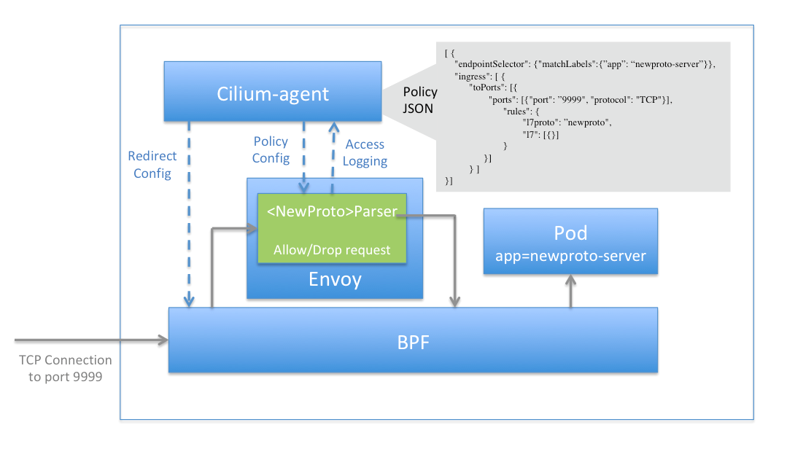

Cilium 能够透明地将四层代理注入任何网络连接中。这被用作执行更高级别网络策略的基础（请参阅[基于 DNS ](https://docs.cilium.io/en/stable/policy/language/#dns-based)和 [七层示例](https://docs.cilium.io/en/stable/policy/language/#l7-policy)）。

可以注入以下代理：

- Envoy

## 注入 Envoy 代理


此功能目前正处于测试阶段。


如果你有兴趣编写 Envoy 代理的 Go 扩展，请参考[开发者指南](https://docs.cilium.io/en/stable/concepts/security/proxy/envoy/)。

如上所述，该框架允许开发人员编写少量 Go 代码（绿色框），专注于解析新的 API 协议，并且该 Go 代码能够充分利用 Cilium 功能，包括高性能重定向 Envoy、丰富的七层感知策略语言和访问日志记录，以及通过 kTLS 对加密流量的可视性（即将推出）。总而言之，作为开发者的你只需要关心解析协议的逻辑，Cilium + Envoy + eBPF 就完成了繁重的工作。

本指南基于假设的 `r2d2` 协议（参见 [proxylib/r2d2/r2d2parser.go](https://github.com/cilium/cilium/blob/master/proxylib/r2d2/r2d2parser.go)）的简单示例，该协议可用于很久以前在遥远的星系中与简单的协议机器人对话。但它也指向了 `cilium/proxylib` 目录中已经存在的其他真实协议，例如 Memcached 和 Cassandra。



